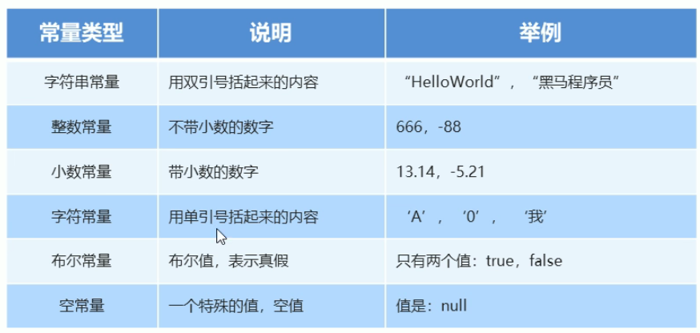
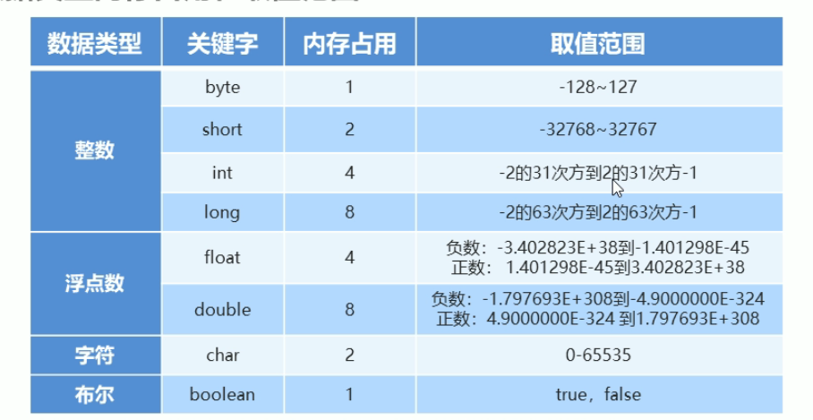
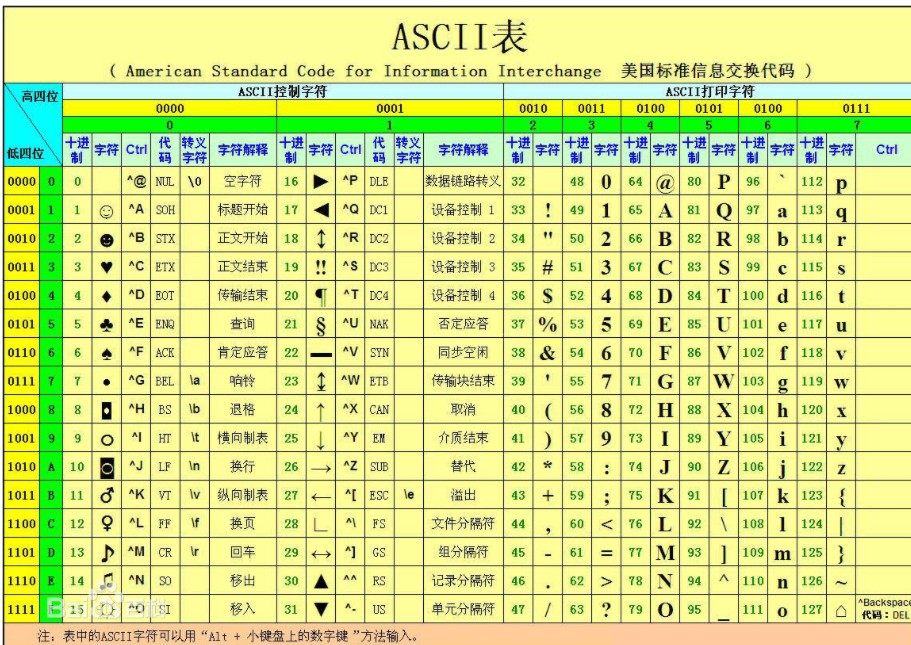

# 笔记
[笔记](#笔记)
  - [注释](#注释)
  - [关键字](#关键字)
  - [常量](#常量)
  - [数据类型](#数据类型)
    - [基本数据类型](#基本数据类型)
  - [变量](#变量)
  - [数据的存储形式: 二进制](#数据的存储形式-二进制)
  - [ASCII编码表](#ascii编码表)
  - [表示符](#表示符)
  - [java语言](#java语言)
    - [类型转换](#类型转换)
    - [运算符](#运算符)
    - [案列知识 ---> 键盘录入技术](#案列知识-----键盘录入技术)

## 注释

* 当行注释 //
* 多行注释 /*xxxxxx*/

## 关键字

* 关键紫的字母小写

## 常量

* 6类常量



## 数据类型

* 存储单位: k, kb, m, G

### 基本数据类型



## 变量

* 变量的定义
  * 可以发生改变的量
* 变量语法
  * 变量名:数据类型:变量值
  * `int a = 10`
  * a , or a = 20 (范例)

* 变量常见的问题:
  * 变量的类型确定,需要复制该类型的值;
  * 同一个范围内不能定义同一个变量;(赋值是可以的)
  * 定义可以不给初始化,使用的时候需要给到初始值;

## 数据的存储形式: 二进制

## ASCII编码表



## 表示符

* 基本:数字,字母,下划线,$组成;
* 不能是数字开始,不能是关键字,区分大小小;
* 命名规则:
  * 驼峰模式;

## java语言

* 数据类型的转换;
* 数据的基本运算,逻辑运算;
* java调用写好的程序;

### 类型转换

* 自动类型转换
  * 类型小的变量,可以直接赋值给类型范围大的变量
  * // a : 00001100
    // b : 0*0* 0* 00001100
  * byte -> short ->(char ->) int -> long -> float -> double

* 表达式的自动转换
  * 结果的数据类型:
  * byte,short,char -> int -> long -> float -> double
  * 表达式的最高的数据类型决定.
  * java

  ```java

     byte a = 10;
     int b = 20;
     double c = 2.0;
     double rs = a + b + c;
     // rs 的数据类型由 c 决定
     ```

* 强制类型转换
  * java

  ```java
  int a = gongneng();
  byte gongneng2(a);
  // 大范围的数据*赋值*给小范围类型的变量
  // 报错: 
  ```

  * 强制转换:
    * 数据类型 变量名 = (强制数据类型) 变量名
  * 数据溢出
  * 浮点型转换为整型小数部分直接丢弃

### 运算符

* 基本算数运算符
  * +, -, /, %
* +符号做连接符
  * 能算则算,不能则连接一起
* 自增自减
  * ++, --,可以放在变量前后
  * 只能操作变量,不能放在常量
  * ++a,先加后赋值....
* 赋值运算符
  * +=, -=, *=, /=, %=
  * 加厚赋值,减后赋值,乘后赋值,取余后赋值
  * 改写法带有强制类型转换
* 关系运算
  * ==, !=, >, <, <=, >=
  * 结果为boolean型
* 逻辑运算
  * 与-&, 或-|,非-!,异或-^
  * && -> 左边是FALSE,右边不执行
  * || -> 左边为TRUE,右边不执行
* 三元运算
  * 条件? 值1:值2
* 运算符优先级
  * && 优先级高于 ||

### 案列知识 ---> 键盘录入技术

* API,应用程序编程接口,写好的程序,直接调用
* 导入包 ```import```
