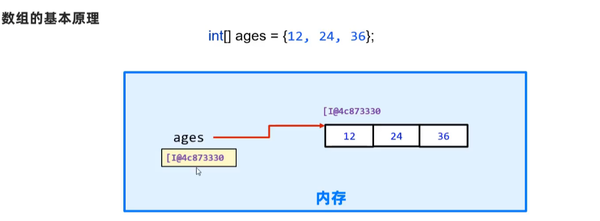
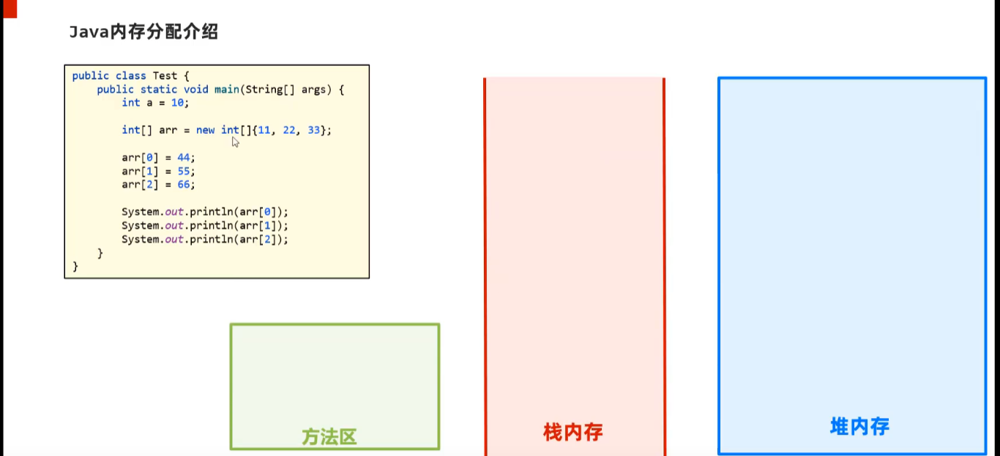
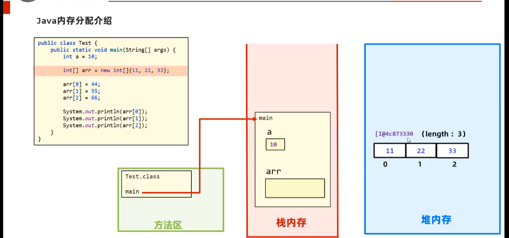
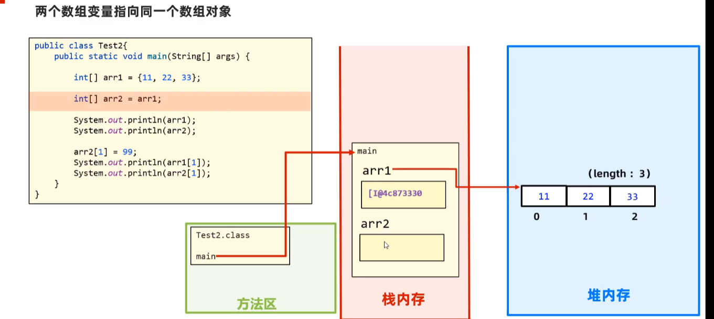

# 笔记

[笔记](#笔记)

- [笔记](#笔记)
  - [注释](#注释)
  - [关键字](#关键字)
  - [常量](#常量)
  - [数据类型](#数据类型)
    - [基本数据类型](#基本数据类型)
  - [变量](#变量)
  - [数据的存储形式: 二进制](#数据的存储形式-二进制)
  - [ASCII编码表](#ascii编码表)
  - [表示符](#表示符)
  - [java语言](#java语言)
    - [类型转换](#类型转换)
    - [运算符](#运算符)
    - [案列知识 ---> 键盘录入技术](#案列知识-----键盘录入技术)
  - [流程控制](#流程控制)
      - [顺序结构](#顺序结构)
      - [分之结构](#分之结构)
      - [循环结构](#循环结构)
  - [数组](#数组)

## 注释

- 当行注释 //
- 多行注释 /*xxxxxx*/

## 关键字

- 关键紫的字母小写

## 常量

- 6类常量


## 数据类型

- 存储单位: k, kb, m, G

### 基本数据类型


## 变量

- 变量的定义
  - 可以发生改变的量
- 变量语法
  - 变量名:数据类型:变量值
  - `int a = 10`
  - a , or a = 20 (范例)

- 变量常见的问题:
  - 变量的类型确定,需要复制该类型的值;
  - 同一个范围内不能定义同一个变量;(赋值是可以的)
  - 定义可以不给初始化,使用的时候需要给到初始值;

## 数据的存储形式: 二进制

## ASCII编码表


## 表示符

- 基本:数字,字母,下划线,$组成;
- 不能是数字开始,不能是关键字,区分大小小;
- 命名规则:
  - 驼峰模式;

## java语言

- 数据类型的转换;
- 数据的基本运算,逻辑运算;
- java调用写好的程序;

### 类型转换

- 自动类型转换
  - 类型小的变量,可以直接赋值给类型范围大的变量
  - // a : 00001100
    // b : 0*0* 0* 00001100
  - byte -> short ->(char ->) int -> long -> float -> double

- 表达式的自动转换
  - 结果的数据类型:
  - byte,short,char -> int -> long -> float -> double
  - 表达式的最高的数据类型决定.
  - java

  ```java

     byte a = 10;
     int b = 20;
     double c = 2.0;
     double rs = a + b + c;
     // rs 的数据类型由 c 决定
     ```

- 强制类型转换
  - java

  ```java
  int a = gongneng();
  byte gongneng2(a);
  // 大范围的数据*赋值*给小范围类型的变量
  // 报错: 
  ```

  - 强制转换:
    - 数据类型 变量名 = (强制数据类型) 变量名
  - 数据溢出
  - 浮点型转换为整型小数部分直接丢弃

### 运算符

- 基本算数运算符
  - +, -, /, %
- +符号做连接符
  - 能算则算,不能则连接一起
- 自增自减
  - ++, --,可以放在变量前后
  - 只能操作变量,不能放在常量
  - ++a,先加后赋值....
- 赋值运算符
  - +=, -=, *=, /=, %=
  - 加厚赋值,减后赋值,乘后赋值,取余后赋值
  - 改写法带有强制类型转换
- 关系运算
  - ==, !=, >, <, <=, >=
  - 结果为boolean型
- 逻辑运算
  - 与-&, 或-|,非-!,异或-^
  - && -> 左边是FALSE,右边不执行
  - || -> 左边为TRUE,右边不执行
- 三元运算
  - 条件? 值1:值2
- 运算符优先级
  - && 优先级高于 ||

### 案列知识 ---> 键盘录入技术

- API,应用程序编程接口,写好的程序,直接调用
- 导入包 ```import```

## 流程控制

#### 顺序结构

- 默认

#### 分之结构

- if, switch,switch穿透
  - if 结构
    - 根据判定的结构,决定执行某个分支代码
    - 三种格式:

    ```java
    格式一:
    if(条件){
      语句体
    }
    格式二:
    if(条件){
      语句体1
    }else{
      语句体2
    }
    格式三:
    if(条件){
      语句1
    }else if{
      语句2
    }else if{
      语句3
    }
    ...
    else{
      语句n+1
    }
    ```

  - switch 结构

   ```java
   switch(条件){
    case 值1:
       执行代码;
       break;
     case 值2:
       执行代码;
       break;
     case 值3:
       执行代码;
       break;
     case n+1:
       执行代码;
       break;
     default:
       执行代码;
   }
   ```

- if 是区间,switch是值来匹配(表达式条件:byte,short,int,char),枚举,string;
- case值不能重复,只能是常量,不能是变量;
- 不要忘记break,否则会出现穿透现象
- 穿透性可以解决多个分支一样的代码时,可以试用.

#### 循环结构

- for, while, do .. while
- for
  - 重复次数执行的结构

   ```java
  格式:
  for (初始化语句;循环条件;迭代语句){
    循环体语句(重复执行);
  }
  ```

- for 案例
  - n 个数的和,奇数,偶数
  - 水仙花数

- while
  
  ```java
  while(条件){
    循环体语句;
    迭代语句;
  }
  ```

  - 功能上for与while一样;
  - 不知道循环次数:while;知道次数:for;
- while 案例
  - 珠峰高度与纸张折叠高度的案例
- do.. while
  - 先执行在循环
  
  ```java
  初始化语句;
  do {
    循环体语句;
    迭代语句;
  } while (循环条件)
  ```

- do.. while 案例
- **总结**:
  - for while 是一样的,次数:for ;while不知道次数;
  - do-while 先执行一次,在判断循环条件,执行次数;
- 死循环
  - 一直循环,不干预会不会停止下去
- 嵌套循环
  - 循环中包含另一个循环.
  - 外部循环执行一次,内部完整的执行循环
- 跳转关键字: break, continue
  - break 跳出并结束当前循环的执行,if 无作用
  - 用于跳出当前循环的档次执行,并执行下个语句,只能用在循环里
- 案例技术: 随机数 Random 类
  - random 的使用
  - 倒包,创建对象,输入随机数

## 数组

- 用内存存储一批**同一种类型**的**内存区域**
- 表示数组: int[] arr = {10,20,30,50,40}
- String[] names = {"牛二","西门","全蛋"}
- 定义数据,获取数据,修改数据,怎么解决实际问题,数据内存的原理,注意点.
  - 静态初始化数据
    - 访问,注意事项

    ```java
    // 完整格式
    数据类型[] 数组名 = new 数据类型[]{元素}
    double[] scores = new double[]{89.0,}
    //简化格式
    int age[] = {1,2,3}
    ```

    - 数组名存的是该数组的**地址**
    - 访问数组里面的数据
    - 索引号来访问,```arr[0]```
    - 数组的长度的访问,```arr.length```
    - 类型放该类型的数据
    - 数组一旦定义,长度和类型就固定了.
  - 动态化数据
    - 初始化默认值
    - 自定义数据的长度和类型,一开始不存数据

    ```java
    数据类型[] 数组名 = new 数据类型[长度]
    int[] arr = new int[10];
    ```

    - 知道数据,用静态,知道长度用动态数组.
- 数组的遍历
  - 一个一个的访问一边
  - 用for循环访问
- 数组的案列
  - 数组求和
  - 数组的最大值判断\
  - 猜数字游戏
  - 随机排名
  - 数组排序
    - 冒泡
    - 最大值放到最后面(最小值放到最前面)
    - 选择
    - 快速
    - 插入
  - 数组相关技术
    - 二分
    - 分块
    - 哈希
- 数组的内存图


- 栈: 方法运行时所进入的内存,变量也在
- 堆: new 出来的东西会在这块内存中开辟空间并产生地址
- 方法区: 字节码文件加载时进入的内存
- 本地方法栈
- 寄存器


- 两个变量指向同一个数组

- 数组的常见问题
  - 访问元素位置超过范围,数组索引越界异常
  - 如果数组变量值没有存储数组的地址,而是null,空指针异常
- Debug 工具的使用
