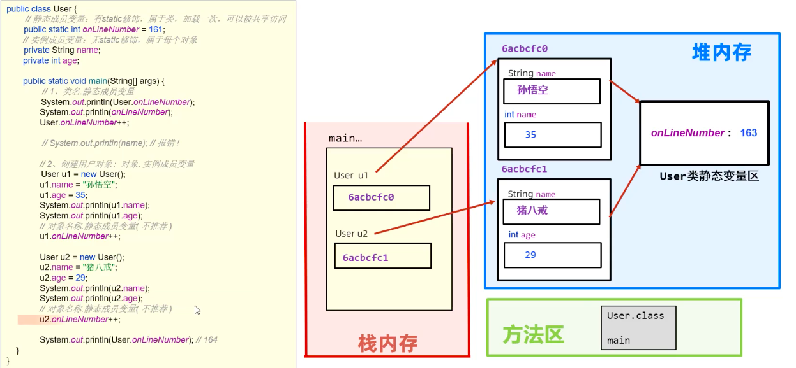
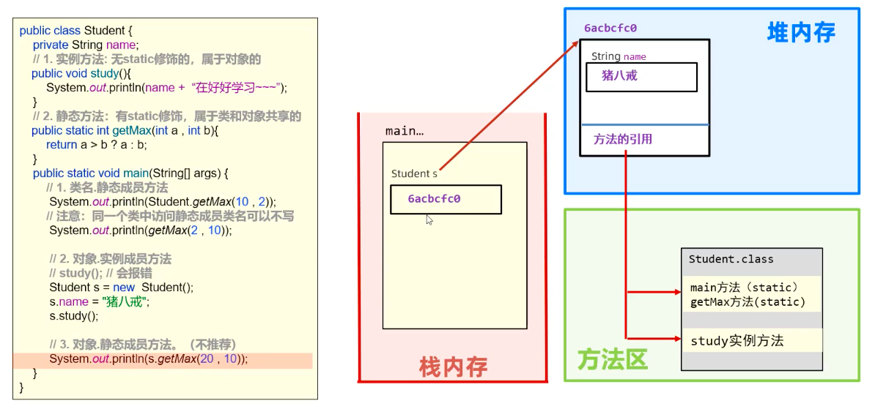
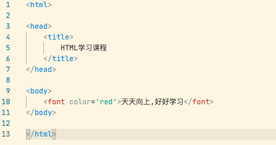

# 笔记

[笔记](#笔记)

- [笔记](#笔记)
  - [注释](#注释)
  - [关键字](#关键字)
  - [常量](#常量)
  - [数据类型](#数据类型)
    - [基本数据类型](#基本数据类型)
  - [变量](#变量)
  - [数据的存储形式: 二进制](#数据的存储形式-二进制)
  - [ASCII编码表](#ascii编码表)
  - [表示符](#表示符)
  - [java语言](#java语言)
    - [类型转换](#类型转换)
    - [运算符](#运算符)
    - [案列知识 ---> 键盘录入技术](#案列知识-----键盘录入技术)
  - [流程控制](#流程控制)
      - [顺序结构](#顺序结构)
      - [分之结构](#分之结构)
      - [循环结构](#循环结构)
  - [数组](#数组)
  - [方法](#方法)
  - [学什么](#学什么)
  - [综合案列](#综合案列)
  - [**面向对象编程(基础)**](#面向对象编程基础)
      - [设计对象](#设计对象)
      - [对象内存图](#对象内存图)
      - [面向对象编程训练](#面向对象编程训练)
      - [构造器](#构造器)
      - [**this 关键字**](#this-关键字)
      - [封装](#封装)
      - [标准Javabean](#标准javabean)
      - [使用标准 JavaBean 改造购物车模块](#使用标准-javabean-改造购物车模块)
      - [补充知识:成员变量/局部变量的区别](#补充知识成员变量局部变量的区别)
  - [常用API(应用程序编程接口)](#常用api应用程序编程接口)
  - [进阶知识](#进阶知识)
  - [ATM 系统](#atm-系统)
  - [面向对象进阶](#面向对象进阶)
  - [继承(面向对象三大之一)](#继承面向对象三大之一)
  - [接口](#接口)
  - [常用API](#常用api)
  - [集合的概述](#集合的概述)
    - [collection 集合的体系结构(接口...是接口)](#collection-集合的体系结构接口是接口)
    - [常用API](#常用api-1)
    - [常见数据结构](#常见数据结构)
    - [Set系列集合/Map集合体系](#set系列集合map集合体系)
    - [补充知识](#补充知识)
  - [File / 方法递归 / IO流](#file--方法递归--io流)
    - [File类](#file类)
    - [方法递归](#方法递归)
    - [字符集](#字符集)
    - [IO流类](#io流类)
  - [多线程](#多线程)
    - [多线程的创建](#多线程的创建)
    - [Thread类的常用方法](#thread类的常用方法)
    - [线程安全,线程同步](#线程安全线程同步)
    - [线程通信](#线程通信)
    - [线程池](#线程池)
    - [定时器,线程状态](#定时器线程状态)
    - [并发与并行](#并发与并行)
    - [线程的生命周期](#线程的生命周期)
  - [网络编程](#网络编程)
    - [网络通信基本模式](#网络通信基本模式)
    - [网络通信三要素](#网络通信三要素)
    - [UDP通信 - 快速入门](#udp通信---快速入门)
    - [UDP通信 - 广播,组播](#udp通信---广播组播)
    - [TCP通信 - 快速入门](#tcp通信---快速入门)
    - [TCP通信 - 多发多收消息](#tcp通信---多发多收消息)
    - [TCP.. - 同时接受多个客户消息](#tcp---同时接受多个客户消息)
    - [TCP.. - 使用线程池优化](#tcp---使用线程池优化)
    - [TCP案例 - 即时通信](#tcp案例---即时通信)
    - [TCP案例 - 模拟BS系统](#tcp案例---模拟bs系统)
  - [单元测试/反射/注解/动态代理](#单元测试反射注解动态代理)
    - [单元测试: 系统中方法的正确性进行测试](#单元测试-系统中方法的正确性进行测试)
    - [反射: 在程序运行时去得到Class对象,然后去获取Class中的每个成分](#反射-在程序运行时去得到class对象然后去获取class中的每个成分)
    - [注解: 解释文本](#注解-解释文本)
    - [动态代理: 设计模式,框架技术的底层会用到的](#动态代理-设计模式框架技术的底层会用到的)
  - [XML解析](#xml解析)
  - [数据库学习](#数据库学习)
    - [MySQL的安装](#mysql的安装)
    - [MySQL的操作](#mysql的操作)
    - [表的操作](#表的操作)
    - [DQL 数据](#dql-数据)
    - [数据库](#数据库)
  - [JDBC](#jdbc)
    - [简介](#简介)
    - [快速入门](#快速入门)
    - [JDBC API](#jdbc-api)
    - [数据库连接池](#数据库连接池)
    - [案例](#案例)
  - [Maven](#maven)
    - [管理构建JAVA项目工具](#管理构建java项目工具)
    - [maven简介](#maven简介)
    - [maven安装配置](#maven安装配置)
    - [maven基本使用](#maven基本使用)
    - [IDEA配置](#idea配置)
    - [依赖管理](#依赖管理)
  - [mybatis](#mybatis)
    - [MyBatis 快速入门](#mybatis-快速入门)
    - [mapper代理](#mapper代理)
    - [mybatis-config.xml 核心配置](#mybatis-configxml-核心配置)
    - [mybatis综合安列](#mybatis综合安列)
  - [HTML 学习](#html-学习)
    - [快速入门](#快速入门-1)
    - [基础标签](#基础标签)
    - [图片,音频,视频](#图片音频视频)
    - [超链接](#超链接)
    - [列表标签](#列表标签)
    - [表格标签](#表格标签)
    - [布局抱歉](#布局抱歉)
    - [表单标签](#表单标签)
  - [CSS 学习 -- 层叠样式表](#css-学习----层叠样式表)
    - [与HTML结合方式](#与html结合方式)
    - [选择器](#选择器)
    - [属性](#属性)
  - [JavaScript学习(面向对象,跨平台的脚本语言)ES6](#javascript学习面向对象跨平台的脚本语言es6)
  - [web核心](#web核心)
    - [HTTP请求](#http请求)
    - [HTTP响应](#http响应)
    - [Apache Tomcat学习](#apache-tomcat学习)
  - [Servlet 动态web资源开发技术](#servlet-动态web资源开发技术)
  - [Request Response](#request-response)
    - [Requst](#requst)
    - [Response](#response)
    - [案例](#案例-1)
      - [用户登录](#用户登录)
      - [用户注册](#用户注册)
      - [问题](#问题)

## 注释

- 当行注释 //
- 多行注释 /*xxxxxx*/

## 关键字

- 关键紫的字母小写

## 常量

- 6类常量


## 数据类型

- 存储单位: k, kb, m, G

### 基本数据类型


## 变量

- 变量的定义

  - 可以发生改变的量
- 变量语法

  - 变量名:数据类型:变量值
  - `int a = 10`
  - a , or a = 20 (范例)
- 变量常见的问题:

  - 变量的类型确定,需要复制该类型的值;
  - 同一个范围内不能定义同一个变量;(赋值是可以的)
  - 定义可以不给初始化,使用的时候需要给到初始值;

## 数据的存储形式: 二进制

## ASCII编码表


## 表示符

- 基本:数字,字母,下划线,$组成;
- 不能是数字开始,不能是关键字,区分大小小;
- 命名规则:
  - 驼峰模式;

## java语言

- 数据类型的转换;
- 数据的基本运算,逻辑运算;
- java调用写好的程序;

### 类型转换

- 自动类型转换

  - 类型小的变量,可以直接赋值给类型范围大的变量
  - // a : 00001100
    // b : 0*0* 0* 00001100
  - byte -> short ->(char ->) int -> long -> float -> double
- 表达式的自动转换

  - 结果的数据类型:
  - byte,short,char -> int -> long -> float -> double
  - 表达式的最高的数据类型决定.
  - java

  ```java

     byte a = 10;
     int b = 20;
     double c = 2.0;
     double rs = a + b + c;
     // rs 的数据类型由 c 决定
  ```

- 强制类型转换

  - java

  ```java
  int a = gongneng();
  byte gongneng2(a);
  // 大范围的数据*赋值*给小范围类型的变量
  // 报错: 
  ```

  - 强制转换:
    - 数据类型 变量名 = (强制数据类型) 变量名
  - 数据溢出
  - 浮点型转换为整型小数部分直接丢弃

### 运算符

- 基本算数运算符
  - +, -, /, %
- +符号做连接符
  - 能算则算,不能则连接一起
- 自增自减
  - ++, --,可以放在变量前后
  - 只能操作变量,不能放在常量
  - ++a,先加后赋值....
- 赋值运算符
  - +=, -=, *=, /=, %=
  - 加厚赋值,减后赋值,乘后赋值,取余后赋值
  - 改写法带有强制类型转换
- 关系运算
  - ==, !=, >, <, <=, >=
  - 结果为boolean型
- 逻辑运算
  - 与-&, 或-|,非-!,异或-^
  - && -> 左边是FALSE,右边不执行
  - || -> 左边为TRUE,右边不执行
- 三元运算
  - 条件? 值1:值2
- 运算符优先级
  - && 优先级高于 ||

### 案列知识 ---> 键盘录入技术

- API,应用程序编程接口,写好的程序,直接调用
- 导入包 ```import```

## 流程控制

#### 顺序结构

- 默认

#### 分之结构

- if, switch,switch穿透

  - if 结构

    - 根据判定的结构,决定执行某个分支代码
    - 三种格式:

    ```java
    格式一:
    if(条件){
      语句体
    }
    格式二:
    if(条件){
      语句体1
    }else{
      语句体2
    }
    格式三:
    if(条件){
      语句1
    }else if{
      语句2
    }else if{
      语句3
    }
    ...
    else{
      语句n+1
    }
    ```

  - switch 结构

  ```java
  switch(条件){
   case 值1:
      执行代码;
      break;
    case 值2:
      执行代码;
      break;
    case 值3:
      执行代码;
      break;
    case n+1:
      执行代码;
      break;
    default:
      执行代码;
  }
  ```

- if 是区间,switch是值来匹配(表达式条件:byte,short,int,char),枚举,string;
- case值不能重复,只能是常量,不能是变量;
- 不要忘记break,否则会出现穿透现象
- 穿透性可以解决多个分支一样的代码时,可以试用.

#### 循环结构

- for, while, do .. while
- for

  - 重复次数执行的结构

  ```java
  格式:
  for (初始化语句;循环条件;迭代语句){
   循环体语句(重复执行);
  }
  ```

- for 案例

  - n 个数的和,奇数,偶数
  - 水仙花数
- while

  ```java
  while(条件){
    循环体语句;
    迭代语句;
  }
  ```

  - 功能上for与while一样;
  - 不知道循环次数:while;知道次数:for;
- while 案例

  - 珠峰高度与纸张折叠高度的案例
- do.. while

  - 先执行在循环

  ```java
  初始化语句;
  do {
    循环体语句;
    迭代语句;
  } while (循环条件)
  ```

- do.. while 案例
- **总结**:

  - for while 是一样的,次数:for ;while不知道次数;
  - do-while 先执行一次,在判断循环条件,执行次数;
- 死循环

  - 一直循环,不干预会不会停止下去
- 嵌套循环

  - 循环中包含另一个循环.
  - 外部循环执行一次,内部完整的执行循环
- 跳转关键字: break, continue

  - break 跳出并结束当前循环的执行,if 无作用
  - 用于跳出当前循环的档次执行,并执行下个语句,只能用在循环里
- 案例技术: 随机数 Random 类

  - random 的使用
  - 倒包,创建对象,输入随机数

## 数组

- 用内存存储一批**同一种类型**的**内存区域**
- 表示数组: int[] arr = {10,20,30,50,40}
- String[] names = {"牛二","西门","全蛋"}
- 定义数据,获取数据,修改数据,怎么解决实际问题,数据内存的原理,注意点.

  - 静态初始化数据

    - 访问,注意事项

    ```java
    // 完整格式
    数据类型[] 数组名 = new 数据类型[]{元素}
    double[] scores = new double[]{89.0,}
    //简化格式
    int age[] = {1,2,3}
    ```

    - 数组名存的是该数组的**地址**
    - 访问数组里面的数据
    - 索引号来访问,```arr[0]```
    - 数组的长度的访问,```arr.length```
    - 类型放该类型的数据
    - 数组一旦定义,长度和类型就固定了.
  - 动态化数据

    - 初始化默认值
    - 自定义数据的长度和类型,一开始不存数据

    ```java
    数据类型[] 数组名 = new 数据类型[长度]
    int[] arr = new int[10];
    ```

    - 知道数据,用静态,知道长度用动态数组.
- 数组的遍历

  - 一个一个的访问一边
  - 用for循环访问
- 数组的案列

  - 数组求和
  - 数组的最大值判断\
  - 猜数字游戏
  - 随机排名
  - 数组排序
    - 冒泡
    - 最大值放到最后面(最小值放到最前面)
    - 选择
    - 快速
    - 插入
  - 数组相关技术
    - 二分
    - 分块
    - 哈希
- 数组的内存图
  
- 栈: 方法运行时所进入的内存,变量也在
- 堆: new 出来的东西会在这块内存中开辟空间并产生地址
- 方法区: 字节码文件加载时进入的内存
- 本地方法栈
- 寄存器
  
  
- 两个变量指向同一个数组
  
- 数组的常见问题

  - 访问元素位置超过范围,数组索引越界异常
  - 如果数组变量值没有存储数组的地址,而是null,空指针异常
- Debug 工具的使用

  - 调试工具
    

## 方法

- 概述,定义,常见问题
- 形参可以有,可以多个,但不不能初始化.
  - 实现一定功能的模块
  - 提高代码复用性
  - 让代码逻辑更清晰
- 注意事项:
  - 方法编写顺序没有关系
  - 方法与方法之间是平行关系,不能嵌套
  - void 的类型方法,不能用 return
  - return 下面不能再写代码,是执行不到的语句.
  - 方法不调用就不执行,严格匹配参数的类型
  - 有返回值得方法可以用变量接,甚至直接调用,无返回值的方法只能直接调用

```java
public class MothodDemo {

    public static void main(String[] args) {
     
        System.out.println(sum(10,20));
    }
    // 方法写法
    public static int sum(int a , int b) {
        int c = a + b;
        return c;
    }
}
```

## 学什么

- 定义方法:

  - 定义形式:

  ```java
  // 修饰符 返回值类型   方法名  形式参数
  public static int sum(int a , int b) {
        int c = a + b;  // 直销代码
        return c;       // 返回值
    }
  // 请他形式方法

  ```

- 无参数,无返回值写法
- 如何调用方法:

  - 方法名();
- 案例
- 内存原理

  - 没有调用在方法区
  - 在方法被调用的时候,需要进入栈内存.
    
    
    
- 方法参数

  - 基本类型参数传递
    - 值传递,传输的不是实参变量本身,而是其存储的值
      
  - 引用类型参数传递
    - 数组,是变量本身的传递,而非值得传递,即变量内容方法可改变.
      
  - 都是传值,基本传的是数据只,引用传的地址值
- 参数案例

  - 打印数组的内容方法---该数组:[11,22,33,44]
  - 从数组中查询元素的索引返回
  - 比较两个数组是否一样
- 方法重载,return

  - 方法重载:
  - 同一个类中,出现过个方法名相同,但形式不一样,就是方法重载.
  - 方法重载的识别技巧:
    - 方法名相同,形参不同
    - 形参的个数.类型,顺序不同
    - return 关键字,单独使用

## 综合案列

- 变量,数组;运算符的使用;程序流程控制;跳转关键字的使用;方法
- 编程思维,模仿,学习,创造.
- 案例 一: 买飞机票
- 案例 二: 找素数
- 案例 三: 开发验证码
- 案列 四:数组元素的复制
- 案例 五:评委打分
- 案例 六:数字加密
- 案例 七:模拟双色球

## **面向对象编程(基础)**

- 一种编程思想;
- 人类思维,理解,操作简单
- 获取已有对象,学习自己设计对象

#### 设计对象

- 设计,创建对象
- 设计类: 是对象共同特征的描述,对象是真实存在的具体实例;
- 成员变量--代表属性
- 成员方法--代表行为
  
- 构造器
- 代码块
- 内部类
- 定义类的几个补充注意事项
  - 成员变量一般无需指定初始化,存在默认值
    
  - 类首字母大写,驼峰模式
  - 一个代码可以多个类,但只允许一个public 类,且public类要与文件名一致.
  - 建议一个文件定义一个class
  - 修饰符 数据类型 成员名 = 初始化只

#### 对象内存图

- 对个对象内存的工作原理
  
  - 对象存放在堆内存
  - 成员变量在对象中,存在堆内存.
  - 两个变量指向一个对象.
    
  - 垃圾回收机制:
    - 当堆内存的对象和数组,没有被任何变量应用(指向)是,就会被判定为内存垃圾
    - java存在的自动垃圾回收器,定期会进行清理

#### 面向对象编程训练

- 模拟购物车模块
- 老师写的不太好,应该想办法先写查询,利用查询写添加,修改等等
- 而不是单独在写一个gebyid的方法.
- 整个模块太繁杂.

#### 构造器

- 对象具体调用
- 掌握属性赋值
- 构造器:用于初始化一个类的对象,并返回对象地址
- ```Car c = new Car();```

  ```java
  public class Car(){
    // 无参数构造器
    public Car(){

    }
    // 有参数构造器
    public Car(String n, String b)
    }
  }
  ```

- 类中默认含有无惨构造器
- 有有参数构造器,就必须手动写一个无参数构造器才能调用

#### **this 关键字**

- 作用:出现在成员方法/构造器中代表当前对象的地址,
- 用于访问当前对象的成员变量/成员方法.
- this 出现在有参数构造器中的用法:
  - this.name ; this price;
- this 成员方法中
  - this.name
    

#### 封装

- 面向对象的三大特征之一:封装/集成,多态
- 影藏细节,暴露出合适的访问方式
- private(私有)关键字进行隐藏,只能在当前类中访问
- 给他一个public 修饰的公开的getter,setter方法进行暴露给外包取值和赋值.

#### 标准Javabean

- 实体类,起对象可以用于在程序中封装数据
- 满足 成员变量用private修饰
- 提供成套的set,get
- 必须提供一个无参数构造器

#### 使用标准 JavaBean 改造购物车模块

#### 补充知识:成员变量/局部变量的区别


## 常用API(应用程序编程接口)

- String / ArrayList
- String 字符串存储,很多字符串的操作.
  - 定义变量
  - 指向字符串对象,并操作
  - ```String name = "sdjfalskdj"```
  - 对象创建后不能被更改
  - 字符串常量池--在堆里面/内存原理
  - 
  - 创建字符串对象(两种方式)

    ```java
    String bianliang = "xxxx";
    public String()
    public String(Sting original)
    public String(char[] chs)
    public String(byte[] chs)

    ```

  - ""方式给出的字符串对象,在字符串常量池中存储,而且相同内容只会在其中存储一份
  - 通过构造器new对象,每new一次都会产生一个新对象,放在堆内存中
    
    
  - 面试题:
  - 常用API,字符串比较
  - "==" 比较的是变量的指向地址(基本数据类型用就可以)
  - equals 比较内容,不关心地址,业务实际需求
  - 功能:遍历,替换,截取,相等,包含
    
  - 解决实际问题

    - 开发验证码功能
    - 模拟用户登录功能
    - 手机号码屏蔽
- ArrayList,集合大小不固定
  - 数组类型,长度就固定了;实际业务场景不太好用
  - 大小,类型不固定,提供丰富的API;
  - 定义,创建
    - ArrayList,支持索引的一种集合;
    - 构造器来创建;
    - 泛型,ArrayList<E>,约定对象只能操作某种数据类型
    - ArrayList<Sting>:次集合只能操作字符串类型元素
    - 集中只能存储引用类型,不支持基本数据类型
    - 
  - 功能:添加,获取,删除,修改
    - 遍历倒着删除,不出问题
  - 存储自定义对象,底层原理
  - 
  - 结合元素的搜索
  - 学生ID查找案列
  - 解决实际问题
  - ATM取款案例

## 进阶知识

- javaSE 加强课程
  - 深入的面相对象的知识
  - 
- IDEA 开发模式的统一
- 
- 面相对象的复习

## ATM 系统

- 功能介绍:
- 面相对象编辑
- 试用集合
- 流程控制\
- API相关知识

## 面向对象进阶

- static关键字
  - 作用,修饰成员变量的用法
  - 静态,只在内存存在一份,可以被共享访问和修改
  - 静态成员变量,属于类,内存加载一次
  - 实例成员变量,(name,age等)



- 设计模式: 单列
- 三大特征之一: 继承
- 记住语法,思路,流程 - 解决实际用题
- 静态方法

  - 静态成员方法
  - 实例成员方法
- 表示对象自己的行为,实例方法;执行一个通用的功能为目的,或者需要方便访问
- 内存原理图



- 建议静态方法私有化,不对外产生对象
- 注意事项:

  - 静态只能访问静态成员变量
  - 实例方法可以访问静态方法,也可以访问静态变量
  - 静态方法不能有this 关键字的
- 代码块,类的5大成员之一(成员变量,构造器,方法,代码块,内部类),定义在类中方法外
- 在JAVA 中使用{}括起来的内容为代码块
- 代码块分类

  - 静态代码块
  - 格式: static{}
  - 使用static关键字修饰,随着类加载而加载,并且自动触发,只执行一次
  - 在类加载的时候做一些静态数据初始化的操作,以便使用
- 构造代码块(了解,用的少)
- 设计模式
- 单列:

  - 可以保证系统中,应用改模式的这个类永远只有一个实例,即一个类只有一个实例
  - 任务管理器就只有一个对象
  - 饿汉单列,懒汉单列: 用类获取对象是,对象已经提前创建了
  - 格式: 定义一个类,把构造器私有;定义一个静态变量存储对象

## 继承(面向对象三大之一)

- 继承是类与类的关系
- 多个类可以继承当个类,多个类可以使用单独类的属性和方法
- 多个类叫做子类(派生类),单独的类是父类(基类,超类)

  - extend关键字,继承父类的属性和方法
- 继承的规范:

  - 子类的相同属性和方法(共性)放到父类去定义,子类单独定义自己的其他属性和方法
- 案例:

  - 学生信息/老师信息
- 特点:

  - 子类继承父类的属性和方法,子类不继承父类构造器
  - 子类是否可以继承父类的私有成员变量:可以的
  - 子类是否可以继承父类的静态成员,可以直接使用(属于类的,不算继承)
  - JAVA是单继承
  - 不支持多继承,但支持多层继承
  - JAVA中所有类,直接继承object,或者默认继承object,object是祖宗类.
- 子类访问成员:就近原则

  - 局部范围---子类范围--父类范围 访问机制
- 继承: 方法重写

  - 子类出现父类中一模一样的方法,就称为方法重写
  - 父类不满足子类的需求,即可重写子类的方法
  - (个人思考) 纯方法的重写(无参数,有参数,有参数顺序不同)
  - ```@override```重写注解
  - 方法名,参数列表要一样才能算是重写
  - 私有方法是不能不重写的
  - 重写方法,访问权限必须大于或者等于父类(缺省 < protected < public)
  - 子类不能重写类父类的静态方法
- 子类构造器的特点:

  - 子类所有的构造器都默认会先访问父类中的无惨构造器,在执行
  - 子类初始化时,有可能会使用到父类中的数据,如果没有完成父类成员的初始化,子类将无法使用父类的数据
  - 子类初始化前,一定要调用父类构造器(先完成父类数据空间的初始化)
  - 子类构造器,默认有调用super()构造器
- 子类访问有参父类构造器

  - 初始化继承父类的数据,有参构造器,
  - 在子类构造器中手动书写super(),手动调用父类的有参构造器,先完成父类的数据初始化.
- this super关键字的总结

  - this 访问成员变量,本类方法,本类构造器
  - super 访问成员变量,父类方法,父类构造器
- 包/权限访问
- final 关键字
- 常量
- 枚举,枚举的作用

  - 枚举是之中特殊类型,不是存数据,试做信息的标志和信息的分类
  -

  ```java
  Enum Season{
   SPRING, SUMMER, AUTUMN, WINTER;
  }
  ```

  - 枚举类都是继承枚举类型:java.lang.Enum
  - 枚举都是最终类,不可以被继承
  - 枚举的构造器都是私有的,不可以在外面创建对象
  - 枚举一般默认都是第一行罗列枚举对象名称
- 抽象类

  - 多个子类的各个功能都不太一样,这个时候父类只完成最基本的定义,其他有子类来完成其功能,这种父类就被称作抽象类
  - abstract 关键字来定义.
  - 抽象方法:
    - 抽象类中必须完成子类的基本功能
    - 没有方法体,只有方法签名必须使用abstract修饰
    - 子类一定能是重写抽象类的方法
    - 并且抽象类中的方法,子类不行全部继承重写
  - 特征:
    - 有得有失:得到创建方法,失去创建类;**(不能实例化)**
    - 类有成员抽象发放都有
    - 抽象类不一定有抽象方法
    - 必须全部重写类中的抽象方法
    - abstract 不能修饰变量,代码块,构造器
    - abstract 与 final是互斥关系
    - abstract定义的类作为模板被继承,定义的方法需要被重写
    - final 定义的类不能被继承,定义的方法不能被重写
- 模板设计模式(单列设计模式)

## 接口

- 特点--抽象方法定义的一组行为规范,一种纯粹的类.
- 是这类实物,必须完成某些行为
- 代码的定义
- jdk8之前之后的定义不太同
-
-
-
-
-
-
-
-
-
-
-
- ```java
  // jdk8 之前:
  public interface 接口名{
    //只能定义:
    // 1.常量
    // 2.抽象方法
  }
  // 不能沟通实例化
  //jdk8之后:
  ```

- 接口基本使用,是被类来实现的(implements),实现接口的类称为实现类.
  ```修饰符 class 实现类 implements 接口1,接口2...{}```
- 一个实现类,必须全部重写所有方法(..)
- 接口与接口的关系:多继承的

  - 类与类 ,但继承
  - 类与接口,多实现,多继承
  - 多继承接口的抽象方法类型,方法名相同,就不冲突
- jdk8开始接口新增的方法

  - 接口的成员方法进行了新增
  - 抽象方法有新功能,必须重写,不利于继承类的代码维护
  - 解决: (默认方法):支持写方法体在接口(普通方法,用default修饰)
  - 静态方法: 默认public 必须使用static修饰
  - 接口的静态方法必须用本身的接口名来调用
  - 私有方法: 必须用private修饰,jdk9
  - 只能在本类中被其他的默认方法或者私有方法访问
- 注意事项:

  - 1/接口不能创建对象(接口是更加彻底的抽象)
  - 2/一个类实现多个接口,多个接口可以同样的静态方法,不冲突(因为接口的静态方法只有接口名可以调用,创建的实例也调用不了)
  - 3/一个类继承了父类,同时又实现了多个接口,父类中和接口中有同名方法,默认用父类的方法
  - 4/一个类实现了多个接口,多个接口中存在同时的默认方法(default),不冲突,这个类重写该方法即可
  - 5/一个接口继承多个接口是没有问题的.如果多个接口中存在规范冲突则不能继承.

## 多态(三大之一)

- 同类型的对象,执行用一个行为,会表现出不同的行为特征
- 多态的常见形式
- 父类类型 对象名称 = new 子类构造器
- 接口 对象名称 = new 实现类构造器
- 多态中的成员访问特点
  - 方法: 编译看左边,运行看右边
  - 变量: 编译看左边,运行也看左边
  - 强调方法多态,变量不多态.
- 前提:有继承/实现关系,父类指向子类对象,有方法重写
- 多态的优势
  - 在多态的形式下,右边的对象可以实现解耦合(切换),便于扩展和维护
  - 定义方法的时候,使用父类型作为参数,该方法就可以接受这个父类的一切子类对象,体现多态的扩展性与便利(对象回调)
  - 多态下不能使用之类的独有的功能
  - 多态下引用数据类型的转换
    - 自动类型转化,子类对象赋值给赋值给父类型的变量转换(向上)
    - 强类型转换(向下):子类 对象变了 = (子类)父类类型的变量,可以实现子类中的独有的方法.

## 内部类

```java
public class outer{
  public class inter{
  
  }
}
```

- 内部类可以访问外部类的成员变量,方法
- 静态/成员/局部/匿名 内部类(重点)
- 静态内部类:

  - 由static 关键字修饰,属于外部类本省
  - 可以访问外部类的静态成员
  - 不可以访问外部类的实例成员,成员变量是对象的,不能直接访问
- 成员内部类

  - 无static修饰,属于外部类的对象(实例)
  - 可以访问外部类的静态成员
  - 内部类访问外部类的实例成员--可以的
- 局部内部类

  - 放在方法,代码块,构造器执行体中
  - 外部类$N内部类.class
- 匿名内部类(重点)

  - 没有名字的局部内部类,定义在方中,代码块中等等
  - 方便创建子类对象,最终目的为了简化代码编写

  ```java
  new 类\抽象类名\接口(){
    重写方法
  }
  ```

  - 没有名字的内部类
  - 写出内部类就会产生一个匿名的对象
  - 匿名对象的类型相对于new类的子类类型
- 匿名内部类常见使用形式

  - 匿名内部类可以当成参数使用
- 实际场景

  - 给按钮绑定点击事件

## 常用API

- Object
  - toString() 类名的地址,可以重写显示对象中的内容
  - equals() 默认比较两个对象的地址是否一直,(==)也可以比较地址
  - 更多的想比较两个对象的内容,子类可以重写定义equals的方法
  - objects 类,,objects.equals.(对象1,对象2),更为安全
- StringBuilder 可变字符串,一个对象容器,只是手段,最后还是需要String的类型
  - 拼接,修改
  - String类萍姐字符串原理图:
  - 不断在堆内存新建内存.不断改变指向.
  - StringBuilder 在堆里只创建一个对象,在一个字符串常量池拼接,效率搞,内存少.
- 案例: 打印整数型数组的内容
- math 类,没有提供公开的构造器,不能创建对象,是一个工具类
  - 功能:
- System 类,不能创建对象,是静态的方法,也是一个工具类
  - 静态方法,用类名调
- BigDecimal 浮点数精度解决问题,可以创建对象,但不建议.
- 时间API
  - 古老时间
  - Date类:当前系统的时间
  - date();SimpleDateFormat()
  - 日期对象,字符串--parse,格式需要一直.
  - 案例
  - calendar 抽象类,不能直接创建类
  - JDK8新增日期时间
    - localDate/localTime/localDateTime/instant/DateTimeFormatter/Duration/Period
    - 新API类型几乎全部是不变的类型
- 认识包装类(8种基本类型对象化,集合,泛型不支持基本类似,怎么解决)
  - 自动装箱,自动拆箱
  - 把基本类型转化成字符串类型
  - 把字符串类型转化成真实数据类型(重点)
  - 容错搞,包装类型 = null
- 正则表达式
  - 校验输入的合法性
  - 体验一个QQ号码是否争正确,6-20为,全部是数字
  - 匹配的规则
    - 字符类(默认匹配一个字符)
    - 预定义的字符类型(默认匹配一个)
    - 贪婪的量词(配合匹配多个)
    - API----x.matches(regex:  )
    - ? 一次或者没有
        - * 零次或者多次
        - + 一次或者多次
    - x[n] n次
    - x{n,}至少 n
    - x{n,m},至少n ,至多 m
- 快速操作数组元素(Array类)
  - API:
  - toString(类型[] a)
  - sort()/sort(comparator)
  - binarySearch()
  - Comparator比较器的支持
- 常见算发
  - 选择排序
  - 二分查找
- Lamada表达式(简化技术--匿名内部函数)
- (形参) -> (方法体)
- **简化 函数式接口,并且只有一个抽象方法**
  - 参数类型可以不写
  - 只有一个参数,类型可省,()可胜率
  - lambda 方法体只有一行代码,可以省略大括号,分号;
  - lambda 方法体只有一行代码,大括号省略,return 省略,;号省略.

## 集合的概述

- 集合和数组都是容器
  - 数字,类型确定,长度固定
  - 数组进行操作都不太合适,需要移位
  - 业务数据固定,同一批类型的时候,可采取
  - 可存储基本类型和引用类型
- 集合是JAva中存储对象数据的容器
  - 大小不固定,动态变化,类型也可以不固定
  - 元素的增删操作
  - 集合只能存储应用类型的数据,基本数据可以用包装类
  - API比较丰富.

### collection 集合的体系结构(接口...是接口)

- 集合 - collection(单列)--list + set

    - - map(双列)      ArrayList    hashset       treeset
- LinkedHashset
- List :元素有序,可重复,有索引(**是接口**)

  - ArrayList,LinkedList  : 有序,重复,索引,底层结构不一样(**实现类**)
- Set : 元素无序,不重复,无索引(**是接口**)

  - HashSet:(**实现类**)
    - LinkedHashset: 有序,不重复,无索引
    - Treeset:按照大小默认升序排列,不重复,无索引
- 集合对于泛型的支持<E>
- 可在编译<写入类型> new 后面的可以省略
- 引用数据类型,对象.集合与泛型不支持基本类型

### 常用API

- Collection 集合API:
- 遍历:
  - foreach 循环的写法
  - 迭代器
  - lambda forEach()方法   变量名.forEach(action)
- collection 集合存储自定义类型的对象

### 常见数据结构

- 计算机底层存储,组织数据的方式,是指数据互相之间是以什么方式排列在一起的
- 数据结构:栈,队列
  - 栈:LIFO;压栈,进栈;弹/出栈;
  - 队列:FIFO;入列,出列
- 数组,链表
  - 数组:内存中的一块连续的区域,长度,索引,类型:查询速度块(索引来查询)
  - 增加,删除数组的效率低,有移位的操作
  - 链表:内存中不连续存储,每个元素都包含数据值和一下个元素的地址
  - 结点(数据,下一个元素的地址)->
  - 查询比较慢的数据结构,增加删除数据较快的.
  - 单向列表,双向列表(用的比较多)
- 二叉树,二叉树查找
  - 最多有两个结点
  - 左结点< 父结点 < 右结点
  - 相关概念:根节点,子树
  - 结点度(子树的个数)
  - 高度: 叶子结点高度为 1,叶子结点的父结点高度为2
  - 层:根结点为第一层
  - 兄弟结点:拥有共同父节点的结点
  - 二叉查找树---排序树,搜索树
- 平衡二叉树
  - 降低层数
  - 任意结点的高度差不超过1,任意结点的左右两个子树都是一个二叉树.
  - 左旋,右旋保持平衡
  - 那边高,拉另一边
- 红黑树
  - 一种自平衡二叉树
  - 每一结点都可以是红或黑,不是通过高度平衡的.红黑规则
  - 每一个节点或是红色,黑色,根结点必须是黑色
  - 如果一个节点没有子节点或者父节点,则该节点相应的指针属性为Nil,这些Nil视为子节点,叶节点是黑色
  - 如果某一个节点是红色,那么他的子节点必须是黑色(不能同时出现两个红色节点相连的情况)
  - 对每一个节点,从该节点到其他所有后代叶节点的简单路劲上,均包含相同数目的黑色节点
  - 默认用红色效率高
  - 添加为红色,(父叔为红色)将父结点和叔叔结点变成黑色, 祖父结点变成红色(根结的化变成黑色)
  - 添加为红色,(父为红,叔为黑),将父结点变成黑色,祖父结点变成红色,在以父结点进行旋转.
- List系列集合
  - ArrayList ,LinkedLish 有序,可重复,有索引,二则底层原理是不一样的.
  - ArrayList,数字实现的,增删慢
  - LinkedList,双链表实现的,首尾操作速度块.
  - API,独特索引的API.
  - 遍历方式小结:
    - 迭代器,增强for,lambda,for(索引)
- LinkedList集合的底层原理(双链表)
  - 可以完成队列和栈结构的
- 集合的并发修改异常问题
  - 迭代器删除(有该异常问题) 可以解决
  - forEach 删除 不能解决问题
  - lambda 无法解决
  - for循环 可以
- 泛型
  - 优势,自定义及方法,接口,通配符,上下限
  - 统一数据类型
  - 运行的问题提到编译期间,避免强制类型转换出现问题
  - 使用,类后面,泛型方法,泛型接口
  - 修饰符 class 类名<泛型变量>{}
  - ```public class MyArrayList<T>{}```
  - E/T/K/V 表示泛型定义泛型类的时候用
  - ? 可以在"使用泛型"的时候代表一切类型(使用的时候)
  - 泛型的上下限
  - ? extend 父类: ? 必须是父类或者其子类 泛型上限
  - ? super 父类: ? 必须是父类或者起父类 泛型下限

### Set系列集合/Map集合体系

- Set系列集合
  - 概述
    - 无序,存取顺序不一致
    - 不重复,可以去除重复
    - 无索引,不能通过索引来遍历,也不能通过索引来获取元素
    - HashSet: 无序,不重复,无索引(**实现类**)
    - LinkedHashSet 有序,不重复,无索引(**实现类**)
    - TreeSet,排序不重复,无索引(**实现类**)
  - HashSet元素无序的底层原理: 哈希表
    - 采用哈希表存储的数据
    - 一种对于增删改查数据性能都较好的结构
    - 哈希值: 是JDK根据对象的地址,按照某种规则算出来的int类型的数值.
    - Public int hashcode() ,对象哈希值.
    - 同一个对象多次调用,哈希值是一样的,不同的对象不一致
    - 1.7版本前: 数组 + 链表 +(结合哈西算法)
    - 创建一个默认长度16的数组,数组名table
    - 根据元素的哈希值跟数组的长度求余计算出存入的位置(哈希算法)
    - 1.8版本转成红黑树(红黑树)--哈希表
    - 默认加载因子0.75F的数组,数组名table
    - 根据元素的哈希数组的长度计算出应存入的位置
    - 判断当前位置是否为Null,如果是就直接存入,如果位置不为Null,表示有元素,则调用equals方法比较属性值,如果一样,则不存,如果不一样则存入数组
    - 当数组存满到16*0.75 = 12时,就自动扩容,每次扩容原先的两倍.
  - HashSet元素去重复的底层原理
    - 创建一个默认长度16的数组,数组名table
    - 根据元素的哈希值跟数组的长度求余,计算出应存入的位置(哈希算fang)
    - 判断位置是否为Null,如果是直接存入
    - 如果位置不为Null,表示有元素,则调用equals方法比较
    - 如果一样,则不存,如果不一样,则存入数组.
    - 结果:如果希望Set集合认为2个内容一样的对象是重复的,必须重写对象的hashcode()和equals()方法.
    - 案例: 创建一个存储学生对象的集合,存储多个学生对象,使用程序实现在控制台遍历该集合,要求:学生对象的成员变量值相同,我们就认为是同一个对象
      - 定义学生对象,创建hashset
      - 添加学生对象到集合
      - 在学生中重写两个放,遍历
  - 实现类: LinkedHashSet
    - 有序,不重复,无索引
    - 有序指的是保证存储和取出的元素是一致的.
    - 底层的原理,哈希表,只是每个元素又额外多了一个双链表的机制记录存储的顺序.
  - 实现类: TreeSet
    - 不重复,无索引,可排序
    - 指的是大小顺序(基于红黑树的数据结构实现排序,可以默认规则或者指定规则排序)
    - int double 按照大小
    - 字符串按照首字母
    - 对于对象无法直接排序,需要制定排序规则(2方式)
    - 实现compareble接口,
    - comparetor接口对应的比较器
- Collection 体系的特点,使用场景
  - ArrayList: 可以重复,又有索引,索引查询块(用的最多)(基于数组)
  - LinkedList: 可以重复,又有索引,增删首尾操作.(基于链表)
  - HashSet: 增删改查,不重复,无序,无索引(基于哈希表)
  - LinkedHashSet: 不重复,有序,无索引(基于哈希表和双链表)
  - TreeSet: 对对象排序(基于红黑树,后续也可以用list实现)
- 补充知识: 可变参数
  - 参数个数可以是0-多个
  - 形参中接受多个参数
  - 数据类型...参数名(可以接一个,或者多个)
  - 本质上是一个数组(形参)
- 补充知识: 集合工具类Collections 体系的综合案例
  - 静态方法（直接用类名调）
  - 排序，洗牌API
  - 查看文档
  - 案例:斗地主初始化牌,洗牌,发牌,排序
- Map 集合体系
  - map集合体系概述
    - 一种双列集合,每个元素包含两个数据
    - 每个元素格式: Key = value(键值对元素)
    - Collection格式:[元素]
    - map集合完整格式{key1 = value1...}
    - **应用场景: 购物车系统:商品与购买数量 一一对应**
  - 特点
    - Map集合是一个接口(下面是实现类)
    - HashMap - LinkedHashMap(重点)
    - HashTable - properties
    - ... - TreeMap
    - 键: 无序,不重复, 无索引; 值不做要求,可以重复(数学的函数含义类似),可以都使用Null
    - HashMap: 无序,不重复,无索引,值不做要求
    - LinkedHashMap: 有序,不重复,无索引,值不做要求
    - TreeMap: 元素按键值是排序的,不重复,无索引,值不要求
  - 常用API
    - put():添加
    - remove():删除
    - ...
  - 遍历方式一:键找值
    - 先取键,在get值
  - 遍历方式二:键值对
    - 当成整体,取键,取值
  - 遍历方式三:lambda
  - 统计投票人数
  - 集合的实现类HashMap
  - 实现类: LinkedHashMap
  - 实现类: TreeMap
- 补充知识: 集合的嵌套

### 补充知识

- 不可变集合
  - 不可修改的集合
  - 整个生命周期中都是不可改变的
  - 集合数据类型操作更方便,数组太固定,不太合适,集合业务上更适合.
  - 为何不可变
    - 不想修改,只供观看
    - 被不可信库调用时,不可变是安全的
    - 用```of```方法(List / Set / Map)
- Stream 流
  - 得益于lambda所带来的函数变成,引入一个全新的Steam流
  - 用于简化集合和数组操作的API
  - 案例: 创建一个集合,存储多个字符串元素
  - 把集合中的某属性元素存储一个新的集合,
  - 遍历新集合
  - Steam 流的获取
    - API调用,准备操作
    - 中间方法:一次操作完成,进行其他操作 -- 链式操作
    - 终结方法: 只能有一个终结方法,是流水线上的最后一个方法
    - Collection.steam()
    - stream(T[] array)
    - 常用API
    - 综合案例
    - Stream流的收集操作
      - 把Stream流返回到集合或者数组中去.......
      - Stream流是操作的手段,最终的目的还是要返回集合或者数组.
      - collect......collectors
- 认识异常体系
  - 异常体系。语法错误不算异常。
  - 编译或者执行过程中出现的问题。
  - 数组索引越界、空指针，等等
  - Throwable--根类    Error ，，Exception；
  - Error系统级别的，代码无法控制，主要看Exception
  - RuntimeE。。。除ＲＥ之外的异常。
  - 常见运行是异常
    - nullpointerException
    - 数组索引越界错误
    - 类型转换异常---classcastException
    - 数学操作出错 --- arithmeticException
    - 数字转换错误 -- numberformatException
  - 编译时异常
    - 编译截断报错,必须处理,否则代码出错
  - 异常的默认处理流程
    - 出现错误,就立即死亡,不在执行后续逻辑,官方给出提示.
  - 编译时异常的处理机制
    - throws 方法 自己不处理异常,最后抛给JVM虚拟机,程序死亡
    - 建议用 throws Exception
    - try  ... catch... catch ...谁出现,水处理
    - e.printStackTrace()...
  - 运行时异常的处理机制
    - try ... catch
  - 异常处理使代码更稳健的案例
  - 自定义异常
- 日志框架(有点超前,属于项目里面的技术)
  - 日志记录系统运行的信息
  - 阶段项目案例运行记录
  - 概述
    - 记录项目运行的信息,方便查找信息分析运行情况,并永久存储.
    - 输出语句只能在控制太,不能记录起位置,
    - 系统执行的信息选择性的记录到指定的位置(控制台,文件中,数据库)
    - 可以随时开关控制日志的记录,无需修改源码
  - 技术体系结构
    - 日志规范: Commons logging /  Simple logging Facade for JAVA --接口
    - log4j / JUL / logback / 其他实现方式 -- 实现
  - logback概述
    - logback : 性能比 log4j好 -- logback官网学习
    - 三个模块: logback-core , logback-classic/ logback-access.
  - 配置输出位置,格式
  - 配置详情-日志级别设置
  - 配置文件,输出,格式
- 项目: 电影购票系统

## File / 方法递归 / IO流

- 目前存储数据 通过 各种变量容器:基本变量,数组,集合等等---都是在内存中存储,不能长久存储数据.
- 存储数据 -- 硬盘,长久保存. --  文件---数据的载体
- 先学习定位文件...File类定位文件,删除,获取文本本身信息等等操作(不能读取内容)
- 读取文件内容 -- IO流类,,来进行.
- File类的使用(定位,删除,文件信息,文件夹,单文件)
- 方法递归 -- 同归递归来搜索文件
- 字符集 - 数据的形式  - 才能操作读写.
- IO流类 -- 读写等操作,分类(字节流/字符流).

### File类

- 概述
  - 文件,文件夹的操作(文件对象)
  - java.io.File 包下
  - 定位 / 获取文件本身的信息(大小,创建时间,格式等等),删除文件 / 创建文件(文件夹)等功能
  - File 类创建对象:

    ```java

    File(File parent, String child);
    File(String pathname);
    File(String parent, String child);
    File(URI url);
    ```

  - 文件(文件夹)可以存在,或者不存在
  - 路径: 绝对路劲或者相对路劲(同一个工程)
- 常用API
  - 判断文件类型,获取文件信息(...)
  - 创建文件,删除文件功能(...)
  - 遍历文件夹: list()一级文件名称到数组 /listFile() 一级文件对象 到 对象
    - 文件夹不存在,返回 null
    - 文件存着,返回null
    - 空文件夹,长度为0 的数组
    - 隐藏的文件夹 ,,也包含隐藏内容

### 方法递归

- 递归的形式,特点
  - 递归 -- 栈溢出(方法栈)
  - 方法直接调用自己或者简捷调用自己
  - 直接递归
  - 间接递归
- 算法流程和核心要素
  - f(n)=f(n-1)n
  - f(1) = 1
  - 递归的方向必须走向总结点
- 案例
  - 1-n的和
- 金典问题
  - 猴子吃桃子
- 非规律化递归--文件搜索
  - RecursionDemo1.java 文件...
- 非规律化递归 - 喝酒问题

### 字符集

- 字符集的介绍
  - ASCII 字符集 数字,引文,符号
  - 1个字节 8位,,总共表示128个字符信息.
  - GBK:Windows默认的码表,兼容ASCII,包含几万汉子,并支持繁体字和不发日韩文字
  - 以2个字节///65536除以2 ,,3万多...
  - Unicode码表:统一码表,,,万国码,业界字符编码标准
  - 会先通过UTF-8,UTF-16,,
  - UTF-8,,3个字节表示一个汉子.
- 英文和数字一个字节
- GBK,,汉子2个字节
- UTF-8 : 3个字节
- 编码前后需用一致的编码.
- 字符集的编码,解码操作

### IO流类

- 字节流的使用
- FileInputStream:

  - read( byte[] buffer)  - API ,,不能避免中文出现乱码
  - 一次读完全部的字节(不会出现乱码) -- 文件过大,会出现内存溢出...
  - 定义一个与文件大小一样大的数组..
  - readAllBytes(); ====> 官方API..
- FileOutputStream
  -write()方法
- 文件拷贝

  - 字节流拷贝不存在读取中文乱文问题.
  - 输入流,输出了管道,创建buffer,,,,
- 资源释放的方式

  - try ... catch ... finally(finally 一定会执行...)
  - try ... with ... resource
  - try(对象资源-- closeable接口/AutoCloseable接口) ...   catch ...
  - 流定义 try(流对象名)....catch ...
- 字符流的使用

  - 字节流中文容易出现乱码,
  - 字节流容易造成内存溢出错误
  - 每次读一个字符.
  - Reader(输入流) .. Write(写出流)  -- > 抽象类..
  - FIleReader,FileWrite--->实现类..
  - 读取一个字符,,读取一个字符数组
  - 文件输出流
- 字节流适合做一切文件数据的拷贝
- 字节流不适合读取中文内容的输出
- 字符流适合文本文件的读写.
- IO流 --- 缓冲流-- 转换流,-- 序列化 -- 打印流-- IO框架
- 缓冲流

  - 概述
  - 高效流,高级流
  - 自带缓冲区,可以提高原始流读写数据的内存.
  - 性能分析
- 转化流

  - 编码转化
- 序列化对象

  - 以内存为基准,把内存中的对象存储到磁盘文件中去,称为对象的序列化
  - :ObjectOutputStream..
  - transient  透明明..
  - 序列化版本需要对应....
- 打印流

  - printStream,,printwriter
  - 写数据的更方便,更高效的流....
- Properties

  - Map 集合
  - 属性的文件,把自己的对象中的键值对信息存入到一个属性文件中去
  - 后缀是properties..
  - 集合IO流来使用..
  - store(Writer ,string)/load(Reader)
- 补充======IO框架

  - commons-IO概述:
  - FileUtils,,IOUtils
  - 第三方库,导入第三方包...

## 多线程

### 多线程的创建

- 创建方式(三种):继承Thread类/实现Runable/JDK5.0 以后的新增:实现Callable接口
- 方式一: Thread  --- java.lang.Thread
  - 按照面相对象思想 run() 方法==== 继承Thread,,重写run()方法,创建线程,start()启动....
  - 编码简单,,线程类已经继承Thread类,不能在继承其他类,拓展不好...
  - 直接调用run(),就当成普通类调用普通方法..
  - 主线程放到子线程之后...
- 方式二: 实现Runable
  - 创建实现Runable接口的类,创建Runable对象, 创建Thread进行Runable对象的分装,调用start()方法
  - 线程任务知识实现接口,可以继续继承和实现接口,扩展性好
  - 编程多一层对象包装,如果线程有执行结果是不可以直接返回的.
  - 22 实现Runable(匿名内部类写法)
- 方式三:实现Callable接口
  - (run()方法都不能直接返回结果.不适合需要返回线程执行结果的业务场景)
  - Callable和 FutureTask 来实现 有返回结果的多线程
  - 得到任务对象--- 定义实现Callable,重写call()方法,封装要做的事情.
  - 用FutureTask把Callable对象封装成线程任务对象
  - 在吧线程任务交给Thread()处理
  - 调用Thread的start方法启动线程,执行任务
  - 线程执行完毕,通过FutureTask的get方法去获取任务的结果.

### Thread类的常用方法

- getName(),setName(),currentThread()
- sleep(),,,静态方法,可以用类调用...
- yield,join,interupt,stop.

### 线程安全,线程同步

- 线程安全问题,多个线程操作同一个共享资源的时候,可能会出现业务安全问题,称为线程安全问题.
- 线程安全模拟;;;
- 取钱业务-- 两个人同时取钱(两个线程...)
  - 提供一个账户lei
  - 定义一个线程类
  - 创建两个线程对象,传入同一个账户
  - 启动线程,去同一个账户对象中取钱.
  - 访问同一个共享资源,,且存在修改该资源...
- 安全问题解决:
  - 同步思想概述
    - 加锁,把共享资源加锁,每次只能一个线程进入访问完毕以后解锁,然后其他线程才能进来.
  - 方式一: 同步代码块(范围小)
    - 把出现线程安全问题的核心代码上锁.
    - synchronized(同步锁对象){核心代码块} ,其他对象会收影响,建议使用共享资源作为锁对象.,静态方用类.class
  - 方式二: 同步方法(范围大)
    - 给核心方法上锁
    - 修饰符 synchronize (方法上加关键字)
  - 方法三:Lock锁
    - ReentranLock()
    - lock(),,unlock()

### 线程通信

### 线程池

- 复用线程的技术,创建新线程的开销很大.
- 概述: ExecutorService--接口
  - 方一: ExecutorService 的实现类 ThreadPoolExecutor
  - 方二: 使用Executors(线程池的工具类)调用用方法返回不同特点的线程池对象

    ```java
    ThreadPoolExecutor(
      int corePoolSize,                   //  不能小于0,核心线程,长久不能死亡的线程
      int maximumPoolSize,                // 最大数量 >= 核心线程数量
      long keepAliveTime,                 // 不能小于0 (临时线程的最大存活时间) 
      TimeUnit unit,                      // 时间单位  (指定存活时间)
      BlockingQueue<Runnable> workQueue,  // 不能为null (任务队列,有其他的线程进入)
      ThreadFactory threadFactory,        // 指定那个线程工厂:ThreadFactory
      RejectedExecutionHandler handler    // 任务满了的时候,新任务来了怎么办: handle(任务都满了的策略)
      )
    ```

  - 临时线程创建的时机:新任务提交时,发现核心线程都在忙,任务对了满了,并且还可以创建临时线程,此事才会创建临时线程
  - 神恩时候拒绝任务:  核心线程,临时线程,任务队列也满了,新任务过来的时候才会拒绝.
- 线程池API
- 线程池处理Runable任务
  - ExecutorService pool = new ThreadPoolExecutor(...)
- 线程池Callable任务
  - Future<T> submit(Callable<T> tash)
- Executors工具类实现线程池
  - newCachedThreadPool()/newFixedThreadPool(int nThread)/newSingleThreadExecutor()/newScheduledThreadPool(int corePoolSize)
  - 会出现系统风险,,

### 定时器,线程状态

- 定时器
  - 一种控制任务延时调用或者周期调用的技术
  - 闹钟/定时邮件等等
- 方式: Timer/ ScheduleExecutorService
  - Timer
  - timer() -- 构造器
  - Schedule() -- 方法
  - 单线程,多个任务会等待;timer死亡,其他都不能执行了.
- ScheduleExecutorService
  - 内部为线程池
  - 多线程,,一个任务挂掉,其他任务不受影响

### 并发与并行

- 正在运行的程序(软件)就是一个独立的进程,线程是属于进程的,多个线程其实是并发与并行同时进行.
- CPU同时处理线程的数量有限
- CPU会轮训为系统的每个线程服务,由于CPU切换的速度很快,给我们的感觉这些线程在同时执行,这就是并发.(分时轮询执行线程)
- 在同一个时刻,同时有多个线程在被CPU处理并执行  -- 并行..(同一个时刻同时在执行)

### 线程的生命周期

- 线程的各个状态:(线程从生到死的过程,以及中间经理的各种状态及状态转换)
  - JAVA定义了6中状态.
  - 6种状态都定义在Thread类的内部枚举类中.
  - new/runable/blocked/waiting/timed_waiting/terminated
  - 只有线程特征没有线程特征/可运行状态/未获得锁对象,获得多对象/ 获得锁对象调用wait()方法/sleep(不释放锁),wait(释放锁)

## 网络编程

### 网络通信基本模式

- 网络通信三要素/UDP通信模式(直接发送,不确认是否在线)/TCP通信(重点-基于可靠传输,消息需要确认,有多种模型应用多个业务场景)/即时通讯/模拟BS系统
- CS/BS

### 网络通信三要素

- IP 地址:设备在网络中的地址,是唯一的标识
  - 互联网协议地址,上网设备的唯一标识
  - IPv4 ,32位组成(8个字节) -- 0.0.0.0 - 255.255.255.255的范围
  - IPv6 , 128位组成 -- (16个字节) 8个整数: 用十六进制标识(8位)
  - IP地址基本寻路:计算机 -- 域名(DNS) -- 服务器 -- 其他计算机客户端
  - ipconfig(win)ifconfig(mac),, ping IP(域名)
  - 特殊地址:127.0.0.1:本地IP,localhost,只会寻找当前所在IP自己
- IP地址操作类:InetAddress类..获取,ping等操作
- 端口: 应用程序在设备中的唯一标识
  - 0-1023 被预订
  - 1024-49151,分配给用户进程或是某些应用程序
  - 49152-65535 动态端口
- 协议: 数据在网络中传输的规则,常见的协议有UDP和TCP协议
  - 连接和通信数据的规则
  - OSI/TCP-IP协议
  - 传输层常见协议:TCP传输控制协议/UDP用户数据报协议
  - TCP协议特点:
    - 面相连接的可靠通信(在否)
    - 传输前,"三次握手"
      - 客户端-服务端请求/服务端-客户回应/客户-服务确认,建立连接
      - 断开连接"四次挥手断开连接
    - 可进行大数据传输
    - 连接,传输需要确认,完毕后,需释放已建立的连接,通信效率低
  - UDP通信:
    - 无连接,不可靠的协议
    - 源IP,目的IP,
    - 数据包64k
    - 不用确认直接发送
    - 可以广播发送,发送结束无需释放资源,开销小,速度块
    - 语音通话/视频回话

### UDP通信 - 快速入门

- 数据包对象:DatagramPacket
- 接受,发送段对象:DatagramSoket:send.receive方法
- 多发多收消息

### UDP通信 - 广播,组播

- 单播/广播/组播
- 广播: 255.255.255.255
- 组播: 224.0.0.0 - 239.255.255.255

### TCP通信 - 快速入门

- 一发一手
  - 编写客户端代码
  - 编写服务端代码/原理分析

### TCP通信 - 多发多收消息

- 多发多收
  - 加循环
  - 一个线程只有一个客户端,需要用多客户端..
- 多客户端消息(多发多收)
  - 引入多线程
  - 主线程(while死循环,接受socket连接)
  - 子线程多每个客户端的消息.
  - N-N 的模型,,客户端与服务器的关系,,资源容易耗尽
  - 引入线程池处理多个客户消息.

### TCP.. - 同时接受多个客户消息

### TCP.. - 使用线程池优化

### TCP案例 - 即时通信

- 之前做的内容都发给服务器,类似弹幕.
- 一个客户端发送,其他客户端可以接受
- 端口转发
  - 客户端 -- 服务器 - 管道 -- 其他客户端

### TCP案例 - 模拟BS系统

- 浏览器访问服务端,不需要开发客户端
- 主线程: 多个socket Runable 任务 ---- 任务队列(线程池 - 服务端)

## 单元测试/反射/注解/动态代理

### 单元测试: 系统中方法的正确性进行测试

- 概述,入门,常用注解
  - 正对最小的功能单元编写的测试代码,
  - JAVA最小的单元是方法
  - 因此单元测试就是针对JAVA方法的测试,进而检查方法的正确性
- Junit 单元测试框架
  - 开源框架,最新本...
  - 优点: 选择性执行那些测试方法,可以一键全部测试方法
  - 可以生产全部方法的测试报告
  - 单元的某个方法测试失败,不影响其他测试的方法.
- 快速入门
  - 预期结果,正确性测试
  - jar包导入.
    - IDEA集合好了Junit,没有就自己导入
  - 编写测试方法:公开,无参数,无返回的非静态方法
  - 在测试方法上使用@Test注解,标注该方法是一个测试方法
  - 在测试方法中完成被测试方法的预期正确性测试
  - 是一个工具类测试方法.
  - 选中测试方法,Junit运行,良好绿色,失败红色
- 常用注解: @Test @Before:实例方法,之前 @After:实例方法,之后; @BeforeClass: 静态方法,之前; @AfterClass 静态方法,之后
  - 开始执行方法,初始化资源
  - 执行完的方法,释放资源.

  -

### 反射: 在程序运行时去得到Class对象,然后去获取Class中的每个成分

- 概述
- 获取对象
  - 三种方式:
  - Class,对象.class,对象获取
- API:获取构造器,变量,方法,泛型擦除
  - 获取构造器方法:
  - getConstructor() / getDeclareConstructor()
  - 获取成员变量
  - getFiled() / getDeclareFiled()
- 绕过编译截断为集合添加数据
- 运行截断,泛型类型相当于被擦除了.
- 通用框架的底层原理

### 注解: 解释文本

- 概述,注解

### 动态代理: 设计模式,框架技术的底层会用到的

- 功能设计

## XML解析

- Dom4j.jar
- 解析成对象,并封装成某个类型的对象.
- Xpath 检索

## 数据库学习

### MySQL的安装

### MySQL的操作

- 查看数据库: show databases
- 查看表: show tables;
- 新建数据库: create database 数据库名
- 新建数据表: 进入数据库 use 数据库名; create table 表名(
- 字段 数据类型,
- 字段2 数据类型,
- .....(最后一个不带逗号)
- )

### 表的操作

- 修改表:DDL
  - 修改表名 alter table 表名 rename to 新表名;
  - 添加一列: alter table 表名 add 列名 数据类型;
  - 修改数据类型 alter table 表名 modify 列名 新数据类型;
  - 修改列名和数据类型: alter table 表名 change 列名 新列名 新数据类型;
  - 删除列: alter table 表名 drop 列名

- 添加数据: DML
  - 给指定列添加数据 insert into 表名(列名1,列名2,...) values(值1,值2,...);
  - 给全部列添加数据 insert into 表名 values(值1,值2,...);
  - 批量添加数据 insert into 表名(列1,列2,...) values(值1,值2,...),(值1,值2,...),...;
  - 批量添加数据2: insert into 表名 values(值1,值2,...),(值1,值2,...),...;
  - 修改数据
    - update 表名 set 列名=值,列2=值2...,[where 条件]
  - 删除数据
    - delete from 表名 [where 条件]

### DQL 数据

- 查询语法

```mysql
  select 字段列表
  from 表名列表
  where 条件列表
  group by 分组字段
  having 分组后条件
  order by 排序字段
  limit 分页限定
```

- 基本查询
- 条件查询(where)
- 分组查询 (group by)
- 排序查询(order by)

### 数据库

- 约束
  - 外检,,其他
- 数据库设计
  - 软件研发步骤
    - 需求分享 - 设计 - 编码 - 测试 - 安装部署
    - 产品经理 - 架构师(开发工程师) - 开发工程师(移动,前端,UI,后端) - 测试工程师 - 交付(运维工程师)
    - 产品原型 - 软件结构设计,数据库,接口设计,过程实际
  - 数据库设计概念
    - 业务需求,选用DBMS,构造最右选择,数据库中的表结构和表与表的关系过程
    - 有哪些表,表里有那些字段,表与表的关系
  - 数据库设计步骤
    - 一/需求分析(数据是什么,那些属性,特点)
    - 逻辑分析(ER图,不用考虑DBMS)
    - 物理设计(逻辑设计转换为物理设计)
    - 维护设计(对新的需求进行建表;表优化)
  - 一对一
    - 少见 人和身份证,
  - 一对多(多对一)
    - 部门-员工(m - 1)
    - 多的一方建立外键,指向1的主键
  - 多对多
    - 商品和订单(m - m)
    - 建立中间表,中间表至少包含两个外键,分别关联两方的主键
- 多表查询
  - 连接查询
    - 内连接 两个表的交集 隐,显示内连接
    - 外联结:左,,右外连接
  - 子查询
    - 嵌套查询
    - 单行单列
    - 多行多单列
    - 多行多列
- 事务
  - began  rollback
  - 开启事务,提交事务,回滚事务
  - 事务的四大特征
  - ACID
  - 原子性(Atomicty) -- 最小单位
  - 一致性(Consistency) -- 所有数据保持一致
  - 隔离性(Isolation)多个事务,操作可见
  - 持久性(Durability) 数据中的改变是永久的

## JDBC

### 简介

- 概念
- 好处
- 优点

### 快速入门

- 注册驱动
- 获取连接
- 定义SQL语句
- 获取执行SQL对象
- 执行SQL
- 处理返回结果
- 释放资源

### JDBC API

- DriverManager
  - 注册驱动
  - 获取数据库连接
  - getConnection
- Connection
  - 获取执行SQL的对象
  - 管理事务
  - createStatement / prepareStatement / prepareCall
  - 开启事务: setAutoCommit / commit() / rollback()
- Statement
  - 执行SQL语句
  - DDL: executeUpdate(sql)
  - DML: executeUpdate(sql)
  - DQL: executeQuery(sql)
- ResultSet
  - 结果集对象
  - next() / getXXX(参数)
- PreparedStatement

-

### 数据库连接池

- Druid 包--阿里巴巴写的.

### 案例

- 完成商品品牌的数据的增删改查操作
- 准备环境:
  - 数据表 tb_brand
  - 实体类 Brand
  - 测试用列

## Maven

### 管理构建JAVA项目工具

- 项目结构
- 构建流程(编译 - 测试 - 打包 - 发布....)
- 依赖管理机制

### maven简介

- Apache 项目管理和构建工具,它基于项目对象模型(POM)的概念,通过一段描述信息管理项目构建,报告,.
  - pom.xml ------项目对象模型 --------  依赖管理模型 -------- 仓库
  - 构建生命周期/阶段
  - 插件  --- 插件 ----  插件...
  - 本地仓库 -- 中央仓库 -- 远程仓库(私服)

### maven安装配置

- 官网去下载
- compile/clean/test/package/install
- pom.xml
- 生命周期
  - 一次构建过程经历了多少个事件
  - 对生命周期划分为3套
    - clean:清理工作
    - default:核心工作 -- 编译,测试,打包,安装
    - site:产生报告,发布站点
  - 同一生命周期内,执行后边的命令,前边的所有命令会自动执行

### maven基本使用

### IDEA配置

### 依赖管理

- 导入包

```xml
<dependencies>
  <dependency>
    <groupId>mysql</groupId>
    <artifactId>mysql-connector-java</artifactId>
    <version>5.1.46</version>
  </dependency>
</dependencies>
```

- 依赖范围: compile/test/provided/runtime/system/import ```xml  <scope>?</scope>```

## mybatis

### MyBatis 快速入门

- 查看 入门网页简单实例

### mapper代理

- 定义与SQL映射文件同名的Mapper接口,并将Mapper接口和Sql映射文件放置在同一目录下
- 设置SQL映射文件的namespace属性为Mapper接口全限定名
- 在mapper接口中定义方法,方法名就是Sql映射文件中的SQL语句的id,并保持参数类型和返回值的类型一致
- 编码:
  - 通过SqlSession的getMapper方法获取Mapper接口的代理
  - 调用对应的方法完成sql的执行
  - 细节如果mapper接口名称和SQL映射文件的名称相同,且在同一目录下,则可以使用包扫描的方式简化SQL映射文件的加载

```xml
<mappers>
  <pakage name="com.megoo.mapper"/>
</mappers>
```

### mybatis-config.xml 核心配置

### mybatis综合安列

## HTML 学习

### 快速入门



### 基础标签

- h1 --- h6 定义标题

### 图片,音频,视频

- img: src -- URL
  - height: 高度
  - width: 宽带
- audio: src -- URL
  - controls -- 显示播放空间
- video: src -- URL
  - controls -- 显示播放控件

### 超链接

- <a> 标签
- href
- target _self 当前页面_blank 新页面

### 列表标签

- 有序(order)
  - ol - li
- 无序(unorder)
  - ul - li

### 表格标签

- table 定义表格
  - border  规定表格边框的宽度
  - width 规定表格的宽度
  - cellspacing 规定单元格之间的空白
- tr 定义行
  - align 定义内容对象方式
- td 定义单元格
  - rowspan 规定单元格可夸的行数
  - colspan 规定单元格可夸的列数
- th 定义表头单元格

### 布局抱歉

- div 结合css使用 换行 - 块级
- span 结合css使用 不换行 - 行级

### 表单标签

- 登录,注册之类的表单,采集用户输入的信息,
- form 定义表单
  - action : 向和处发送表单数据 URL 指定其name属性.
  - method: 提交方式
    - get - 默认值,参数会拼接在URL里面 ,长度有限制4kb
    - post- 参数会在http的请求体中,长度无限制
- 表单元素:
  - input 表单项
    - type : text,password,
      - radio(单选框 ,加name的属性值一样,提交加value属性(1,2等)),
      - checkbox(定义复选框,name属性,value提交属性值),
      - file(定义文件上传的),hidden 定义隐藏输入字段,submit(提交按钮),Reset(重置按钮),button(可点击的按钮)
  - lable - 与input产生关联, 用for指定 id
  - select - 定义下拉列表 (name的属性)option定义列表向(value 提交option的值)
  - textarea - 文本域(name值,进行提交)

## CSS 学习 -- 层叠样式表

### 与HTML结合方式

- 内联样式 -- 用style属性 div -style
- 内部样式 -- 用style div span
- 外部样式 -- 定义link标签 引入 link 两个属性 href --引入文件  rel属性 = stylesheet

### 选择器

- 选取要设置的标签
- 分类:
  - 元素选择 -- 标签名称
  - id选择器 -- #name{}
  - 类选择器 -- .class 属性值

### 属性

- 查看手册不是重点(后端相对来说)

## JavaScript学习(面向对象,跨平台的脚本语言)ES6

## web核心  

### HTTP请求

- 请求数据格式:get post
- 请求行,请求头(K:V),请求体(post模式)

### HTTP响应

- 响应行(响应转台码)/响应头/响应体
- 响应状态码
  - 1XX,2XX(成功),3XX(重定向),4XX(错误-客户端错误),5XX(服务端错误)

### Apache Tomcat学习

- 简介
  - 轻量级开源免费
  - javaEE
  - web容器,Serlet容器
- 安装 ,卸载
- 配置,部署
  - 修改端口号(8080默认) conf/server.xml --- > Connector 修改
  - war包 放到webapp
- 创建maven web项目
  - 开发中的项目 与之前的maven项目对比,对了一个webAPP(html,WEB-INF/web.xml)
  - 部署目录格式
- tomcat项目创建

## Servlet 动态web资源开发技术

- 快速入门
  - web项目,导入Servlet依赖坐标<scope provided>
  - 定义类 继承impl接口
  - 配置@webservlet
  - 访问,启动
- 执行流程
  - web项目 - tomcat
  - xxx/路径/项目资源
  - Servlet对象  service方法
  - web服务器创建,调用
  - 实现接口,复写方法
- 生命周期
  - 创建到销毁过程
  - 加载和实例化 -- 第一次被访问是,由容器创建Servlet对象
  - 初始化 在Servlet实例化之后,容器将调用Servlet-init()方法,初始化
    - init(),第一次被访问调用,调用一次
    - loadOnStartup -1 , 1
  - 请求处理,每次请求Servlet,容器会调用service
    - service(),每一次Servlet被访问,多次被调用
  - 服务终止,destroy() ,一次
    - 销毁方法,Servlet被销毁(内存释放,服务器关闭),调用一次.
  - getserviceinfo() - 返回版权等无关信息,一般返回null
  - servletConfig对象,
- 体系结构
  - Servlet 体系接口 - GenericServlet 抽象实现类 -- HttpServlet(实现类)  (doGet / doPost)
- urlPattern配置(访问路劲)
  - 配置多个(数组)
  - 规则:精确匹配/目录匹配/扩展名匹配/任意匹配
- xml 配置Servlet

## Request Response

### Requst

- xxxx
- xxxx
- Request 转发
  - req.getRequestDispatcher('资源B').forward(req,rep) 写在A资源里
  - set,get,remove -- Attribute 共享数据.
    - 浏览器地址栏的地址不发生变化
    - 只能转发当前服务器内部资源
    - 一次请求,可以在转发的资源间使用request共享数据
  - (重定向)

### Response

- (set)方法
- ServletResponse(接口) <--- HttpServletResponse(对http协议封装的请求对象) <--- ResponseFacade(Tomcat定义实现类)
- 设置响应数据的功能
  - 响应数据:
    - 响应行 HTTP1.1 200 OK
    - 响应头 Content-Type:text/html
    - 响应体 <html>结构 -- 输出流写出数据...
- 完成重定向
  - 资源A处理不了  定向到资源B去处理 :状态码(302) 位置:location:xxx(找到资源B)
  - resp.setStatus(302) resp.setHeader("location","资源B的路劲") resp.sendRedirect("B资源")
    - 浏览器地址栏发生变化
    - 可以重定向到任意位置的资源(服务器外部,内部均可以)
    - 两次请求,不能在多个资源使用request共享数据
  - 路劲问题
    - 明确路劲给谁使用
      - 浏览器使用:需要加虚拟目录
      - 服务端使用:不需要加虚拟目录
- 响应字符数据(响应体)
  - 字符输出流  ---> getWriter();
  - write(a)
  - resp.setContentType("text/html;charset=utf-8") 文本解析及字符编码一起完成
- 响应字节数据
  - getOutputStream()
  - write()
  - IOUtils.copy(fis,os)

### 案例

#### 用户登录

#### 用户注册

#### 问题

- 创建SqlsessionFactory优化
- 代码重复
- 工厂只创建一次,不要重复重复重建
- sqlsession 必须重写,,一个sqlsession对应一个连接数据库操作的一套事务.