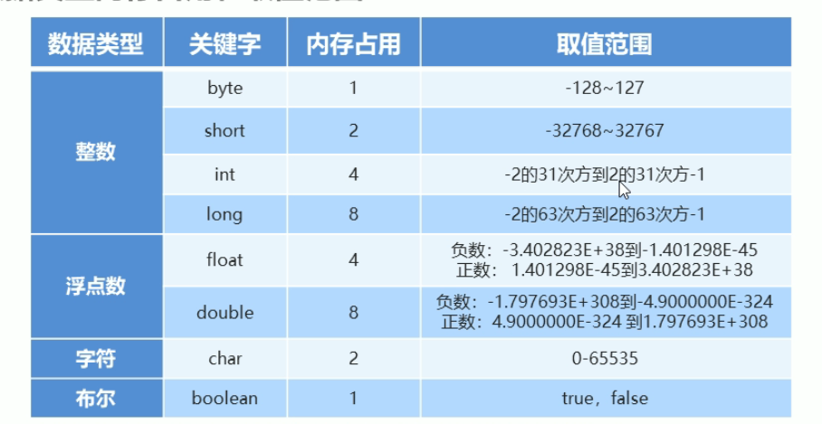

# 笔记

[笔记](#笔记)

- [笔记](#笔记)
  - [注释](#注释)
  - [关键字](#关键字)
  - [常量](#常量)
  - [数据类型](#数据类型)
    - [基本数据类型](#基本数据类型)
  - [变量](#变量)
  - [数据的存储形式: 二进制](#数据的存储形式-二进制)
  - [ASCII编码表](#ascii编码表)
  - [表示符](#表示符)
  - [java语言](#java语言)
    - [类型转换](#类型转换)
    - [运算符](#运算符)
    - [案列知识 ---> 键盘录入技术](#案列知识-----键盘录入技术)
  - [流程控制](#流程控制)
      - [顺序结构](#顺序结构)
      - [分之结构](#分之结构)
      - [循环结构](#循环结构)
  - [数组](#数组)
  - [方法](#方法)
  - [学什么](#学什么)
  - [综合案列](#综合案列)
  - [**面向对象编程(基础)**](#面向对象编程基础)
      - [设计对象](#设计对象)
      - [对象内存图](#对象内存图)
      - [面向对象编程训练](#面向对象编程训练)
      - [构造器](#构造器)
      - [**this 关键字**](#this-关键字)
      - [封装](#封装)
      - [标准Javabean](#标准javabean)
      - [使用标准 JavaBean 改造购物车模块](#使用标准-javabean-改造购物车模块)
      - [补充知识:成员变量/局部变量的区别](#补充知识成员变量局部变量的区别)
  - [常用API(应用程序编程接口)](#常用api应用程序编程接口)
  - [进阶知识](#进阶知识)
  - [ATM 系统](#atm-系统)
  - [面向对象进阶](#面向对象进阶)
  - [继承(面向对象三大之一)](#继承面向对象三大之一)

## 注释

- 当行注释 //
- 多行注释 /*xxxxxx*/

## 关键字

- 关键紫的字母小写

## 常量

- 6类常量


## 数据类型

- 存储单位: k, kb, m, G

### 基本数据类型



## 变量

- 变量的定义
  - 可以发生改变的量
- 变量语法
  - 变量名:数据类型:变量值
  - `int a = 10`
  - a , or a = 20 (范例)

- 变量常见的问题:
  - 变量的类型确定,需要复制该类型的值;
  - 同一个范围内不能定义同一个变量;(赋值是可以的)
  - 定义可以不给初始化,使用的时候需要给到初始值;

## 数据的存储形式: 二进制

## ASCII编码表


## 表示符

- 基本:数字,字母,下划线,$组成;
- 不能是数字开始,不能是关键字,区分大小小;
- 命名规则:
  - 驼峰模式;

## java语言

- 数据类型的转换;
- 数据的基本运算,逻辑运算;
- java调用写好的程序;

### 类型转换

- 自动类型转换
  - 类型小的变量,可以直接赋值给类型范围大的变量
  - // a : 00001100
    // b : 0*0* 0* 00001100
  - byte -> short ->(char ->) int -> long -> float -> double

- 表达式的自动转换
  - 结果的数据类型:
  - byte,short,char -> int -> long -> float -> double
  - 表达式的最高的数据类型决定.
  - java

  ```java

     byte a = 10;
     int b = 20;
     double c = 2.0;
     double rs = a + b + c;
     // rs 的数据类型由 c 决定
     ```

- 强制类型转换
  - java

  ```java
  int a = gongneng();
  byte gongneng2(a);
  // 大范围的数据*赋值*给小范围类型的变量
  // 报错: 
  ```

  - 强制转换:
    - 数据类型 变量名 = (强制数据类型) 变量名
  - 数据溢出
  - 浮点型转换为整型小数部分直接丢弃

### 运算符

- 基本算数运算符
  - +, -, /, %
- +符号做连接符
  - 能算则算,不能则连接一起
- 自增自减
  - ++, --,可以放在变量前后
  - 只能操作变量,不能放在常量
  - ++a,先加后赋值....
- 赋值运算符
  - +=, -=, *=, /=, %=
  - 加厚赋值,减后赋值,乘后赋值,取余后赋值
  - 改写法带有强制类型转换
- 关系运算
  - ==, !=, >, <, <=, >=
  - 结果为boolean型
- 逻辑运算
  - 与-&, 或-|,非-!,异或-^
  - && -> 左边是FALSE,右边不执行
  - || -> 左边为TRUE,右边不执行
- 三元运算
  - 条件? 值1:值2
- 运算符优先级
  - && 优先级高于 ||

### 案列知识 ---> 键盘录入技术

- API,应用程序编程接口,写好的程序,直接调用
- 导入包 ```import```

## 流程控制

#### 顺序结构

- 默认

#### 分之结构

- if, switch,switch穿透
  - if 结构
    - 根据判定的结构,决定执行某个分支代码
    - 三种格式:

    ```java
    格式一:
    if(条件){
      语句体
    }
    格式二:
    if(条件){
      语句体1
    }else{
      语句体2
    }
    格式三:
    if(条件){
      语句1
    }else if{
      语句2
    }else if{
      语句3
    }
    ...
    else{
      语句n+1
    }
    ```

  - switch 结构

   ```java
   switch(条件){
    case 值1:
       执行代码;
       break;
     case 值2:
       执行代码;
       break;
     case 值3:
       执行代码;
       break;
     case n+1:
       执行代码;
       break;
     default:
       执行代码;
   }
   ```

- if 是区间,switch是值来匹配(表达式条件:byte,short,int,char),枚举,string;
- case值不能重复,只能是常量,不能是变量;
- 不要忘记break,否则会出现穿透现象
- 穿透性可以解决多个分支一样的代码时,可以试用.

#### 循环结构

- for, while, do .. while
- for
  - 重复次数执行的结构

   ```java
  格式:
  for (初始化语句;循环条件;迭代语句){
    循环体语句(重复执行);
  }
  ```

- for 案例
  - n 个数的和,奇数,偶数
  - 水仙花数

- while
  
  ```java
  while(条件){
    循环体语句;
    迭代语句;
  }
  ```

  - 功能上for与while一样;
  - 不知道循环次数:while;知道次数:for;
- while 案例
  - 珠峰高度与纸张折叠高度的案例
- do.. while
  - 先执行在循环
  
  ```java
  初始化语句;
  do {
    循环体语句;
    迭代语句;
  } while (循环条件)
  ```

- do.. while 案例
- **总结**:
  - for while 是一样的,次数:for ;while不知道次数;
  - do-while 先执行一次,在判断循环条件,执行次数;
- 死循环
  - 一直循环,不干预会不会停止下去
- 嵌套循环
  - 循环中包含另一个循环.
  - 外部循环执行一次,内部完整的执行循环
- 跳转关键字: break, continue
  - break 跳出并结束当前循环的执行,if 无作用
  - 用于跳出当前循环的档次执行,并执行下个语句,只能用在循环里
- 案例技术: 随机数 Random 类
  - random 的使用
  - 倒包,创建对象,输入随机数

## 数组

- 用内存存储一批**同一种类型**的**内存区域**
- 表示数组: int[] arr = {10,20,30,50,40}
- String[] names = {"牛二","西门","全蛋"}
- 定义数据,获取数据,修改数据,怎么解决实际问题,数据内存的原理,注意点.
  - 静态初始化数据
    - 访问,注意事项

    ```java
    // 完整格式
    数据类型[] 数组名 = new 数据类型[]{元素}
    double[] scores = new double[]{89.0,}
    //简化格式
    int age[] = {1,2,3}
    ```

    - 数组名存的是该数组的**地址**
    - 访问数组里面的数据
    - 索引号来访问,```arr[0]```
    - 数组的长度的访问,```arr.length```
    - 类型放该类型的数据
    - 数组一旦定义,长度和类型就固定了.
  - 动态化数据
    - 初始化默认值
    - 自定义数据的长度和类型,一开始不存数据

    ```java
    数据类型[] 数组名 = new 数据类型[长度]
    int[] arr = new int[10];
    ```

    - 知道数据,用静态,知道长度用动态数组.
- 数组的遍历
  - 一个一个的访问一边
  - 用for循环访问
- 数组的案列
  - 数组求和
  - 数组的最大值判断\
  - 猜数字游戏
  - 随机排名
  - 数组排序
    - 冒泡
    - 最大值放到最后面(最小值放到最前面)
    - 选择
    - 快速
    - 插入
  - 数组相关技术
    - 二分
    - 分块
    - 哈希
- 数组的内存图


- 栈: 方法运行时所进入的内存,变量也在
- 堆: new 出来的东西会在这块内存中开辟空间并产生地址
- 方法区: 字节码文件加载时进入的内存
- 本地方法栈
- 寄存器


- 两个变量指向同一个数组

- 数组的常见问题
  - 访问元素位置超过范围,数组索引越界异常
  - 如果数组变量值没有存储数组的地址,而是null,空指针异常
- Debug 工具的使用
  - 调试工具


## 方法

- 概述,定义,常见问题
- 形参可以有,可以多个,但不不能初始化.
  - 实现一定功能的模块
  - 提高代码复用性
  - 让代码逻辑更清晰
- 注意事项:
  - 方法编写顺序没有关系
  - 方法与方法之间是平行关系,不能嵌套
  - void 的类型方法,不能用 return
  - return 下面不能再写代码,是执行不到的语句.
  - 方法不调用就不执行,严格匹配参数的类型
  - 有返回值得方法可以用变量接,甚至直接调用,无返回值的方法只能直接调用

```java
public class MothodDemo {

    public static void main(String[] args) {
       
        System.out.println(sum(10,20));
    }
    // 方法写法
    public static int sum(int a , int b) {
        int c = a + b;
        return c;
    }
}
```

## 学什么

- 定义方法:
  - 定义形式:
  
  ```java
  // 修饰符 返回值类型   方法名  形式参数
  public static int sum(int a , int b) {
        int c = a + b;  // 直销代码
        return c;       // 返回值
    }
  // 请他形式方法

  ```

- 无参数,无返回值写法
- 如何调用方法:
  - 方法名();
- 案例
- 内存原理
  - 没有调用在方法区
  - 在方法被调用的时候,需要进入栈内存.
  
  
  
- 方法参数
  - 基本类型参数传递
    - 值传递,传输的不是实参变量本身,而是其存储的值
    
  - 引用类型参数传递
    - 数组,是变量本身的传递,而非值得传递,即变量内容方法可改变.
    
  - 都是传值,基本传的是数据只,引用传的地址值
- 参数案例
  - 打印数组的内容方法---该数组:[11,22,33,44]
  - 从数组中查询元素的索引返回
  - 比较两个数组是否一样
- 方法重载,return
  - 方法重载:
  - 同一个类中,出现过个方法名相同,但形式不一样,就是方法重载.
  - 方法重载的识别技巧:
    - 方法名相同,形参不同
    - 形参的个数.类型,顺序不同
    - return 关键字,单独使用

## 综合案列

- 变量,数组;运算符的使用;程序流程控制;跳转关键字的使用;方法
- 编程思维,模仿,学习,创造.
- 案例 一: 买飞机票
- 案例 二: 找素数
- 案例 三: 开发验证码
- 案列 四:数组元素的复制
- 案例 五:评委打分
- 案例 六:数字加密
- 案例 七:模拟双色球

## **面向对象编程(基础)**

- 一种编程思想;
- 人类思维,理解,操作简单
- 获取已有对象,学习自己设计对象
  
#### 设计对象

- 设计,创建对象
- 设计类: 是对象共同特征的描述,对象是真实存在的具体实例;
- 成员变量--代表属性
- 成员方法--代表行为
  
- 构造器
- 代码块
- 内部类
- 定义类的几个补充注意事项
  - 成员变量一般无需指定初始化,存在默认值
    
  - 类首字母大写,驼峰模式
  - 一个代码可以多个类,但只允许一个public 类,且public类要与文件名一致.
  - 建议一个文件定义一个class
  - 修饰符 数据类型 成员名 = 初始化只

#### 对象内存图
  
- 对个对象内存的工作原理
  
  - 对象存放在堆内存
  - 成员变量在对象中,存在堆内存.
  - 两个变量指向一个对象.
    
  - 垃圾回收机制:
    - 当堆内存的对象和数组,没有被任何变量应用(指向)是,就会被判定为内存垃圾
    - java存在的自动垃圾回收器,定期会进行清理

#### 面向对象编程训练

- 模拟购物车模块
- 老师写的不太好,应该想办法先写查询,利用查询写添加,修改等等
- 而不是单独在写一个gebyid的方法.
- 整个模块太繁杂.

#### 构造器

- 对象具体调用
- 掌握属性赋值
- 构造器:用于初始化一个类的对象,并返回对象地址
- ```Car c = new Car();```

  ```java
  public class Car(){
    // 无参数构造器
    public Car(){

    }
    // 有参数构造器
    public Car(String n, String b)
    }
  }
  ```

- 类中默认含有无惨构造器
- 有有参数构造器,就必须手动写一个无参数构造器才能调用

#### **this 关键字**

- 作用:出现在成员方法/构造器中代表当前对象的地址,
- 用于访问当前对象的成员变量/成员方法.
- this 出现在有参数构造器中的用法:
  - this.name ; this price;
- this 成员方法中
  - this.name
  

#### 封装

- 面向对象的三大特征之一:封装/集成,多态
- 影藏细节,暴露出合适的访问方式
- private(私有)关键字进行隐藏,只能在当前类中访问
- 给他一个public 修饰的公开的getter,setter方法进行暴露给外包取值和赋值.

#### 标准Javabean

- 实体类,起对象可以用于在程序中封装数据
- 满足 成员变量用private修饰
- 提供成套的set,get
- 必须提供一个无参数构造器

#### 使用标准 JavaBean 改造购物车模块

#### 补充知识:成员变量/局部变量的区别


## 常用API(应用程序编程接口)

- String / ArrayList
- String 字符串存储,很多字符串的操作.
  - 定义变量
  - 指向字符串对象,并操作
  - ```String name = "sdjfalskdj"```
  - 对象创建后不能被更改
  - 字符串常量池--在堆里面/内存原理
  - 
  - 创建字符串对象(两种方式)

    ```java
    String bianliang = "xxxx";
    public String()
    public String(Sting original)
    public String(char[] chs)
    public String(byte[] chs)
    
    ```

  - ""方式给出的字符串对象,在字符串常量池中存储,而且相同内容只会在其中存储一份
  - 通过构造器new对象,每new一次都会产生一个新对象,放在堆内存中
  
  
  - 面试题:
  - 常用API,字符串比较
  - "==" 比较的是变量的指向地址(基本数据类型用就可以)
  - equals 比较内容,不关心地址,业务实际需求
  - 功能:遍历,替换,截取,相等,包含
    
  - 解决实际问题
    - 开发验证码功能
    - 模拟用户登录功能
    - 手机号码屏蔽
- ArrayList,集合大小不固定
  - 数组类型,长度就固定了;实际业务场景不太好用
  - 大小,类型不固定,提供丰富的API;
  - 定义,创建
    - ArrayList,支持索引的一种集合;
    - 构造器来创建;
    - 泛型,ArrayList<E>,约定对象只能操作某种数据类型
    - ArrayList<Sting>:次集合只能操作字符串类型元素
    - 集中只能存储引用类型,不支持基本数据类型
    - 
  - 功能:添加,获取,删除,修改
    - 遍历倒着删除,不出问题
  - 存储自定义对象,底层原理
  - 
  - 结合元素的搜索
  - 学生ID查找案列
  - 解决实际问题
  - ATM取款案例

## 进阶知识

- javaSE 加强课程
  - 深入的面相对象的知识
  -   
- IDEA 开发模式的统一
- 
- 面相对象的复习

## ATM 系统

- 功能介绍:
- 面相对象编辑
- 试用集合
- 流程控制\
- API相关知识

## 面向对象进阶

- static关键字
  - 作用,修饰成员变量的用法
  - 静态,只在内存存在一份,可以被共享访问和修改
  - 静态成员变量,属于类,内存加载一次
  - 实例成员变量,(name,age等)


- 设计模式: 单列
- 三大特征之一: 继承
- 记住语法,思路,流程 - 解决实际用题

- 静态方法
  - 静态成员方法
  - 实例成员方法
- 表示对象自己的行为,实例方法;执行一个通用的功能为目的,或者需要方便访问
- 内存原理图


- 建议静态方法私有化,不对外产生对象
- 注意事项:
  - 静态只能访问静态成员变量
  - 实例方法可以访问静态方法,也可以访问静态变量
  - 静态方法不能有this 关键字的

- 代码块,类的5大成员之一(成员变量,构造器,方法,代码块,内部类),定义在类中方法外
- 在JAVA 中使用{}括起来的内容为代码块
- 代码块分类
  - 静态代码块
  - 格式: static{}
  - 使用static关键字修饰,随着类加载而加载,并且自动触发,只执行一次
  - 在类加载的时候做一些静态数据初始化的操作,以便使用
- 构造代码块(了解,用的少)
- 设计模式
- 单列:
  - 可以保证系统中,应用改模式的这个类永远只有一个实例,即一个类只有一个实例
  - 任务管理器就只有一个对象
  - 饿汉单列,懒汉单列: 用类获取对象是,对象已经提前创建了
  - 格式: 定义一个类,把构造器私有;定义一个静态变量存储对象

## 继承(面向对象三大之一)

- 继承是类与类的关系
- 多个类可以继承当个类,多个类可以使用单独类的属性和方法
- 多个类叫做子类(派生类),单独的类是父类(基类,超类)
  - extend关键字,继承父类的属性和方法
- 继承的规范:
  - 子类的相同属性和方法(共性)放到父类去定义,子类单独定义自己的其他属性和方法
- 案例:
  - 学生信息/老师信息
- 特点:
  - 子类继承父类的属性和方法,子类不继承父类构造器
  - 子类是否可以继承父类的私有成员变量:可以的
  - 子类是否可以继承父类的静态成员,可以直接使用(属于类的,不算继承)
  - JAVA是单继承
  - 不支持多继承,但支持多层继承
  - JAVA中所有类,直接继承object,或者默认继承object,object是祖宗类.
- 子类访问成员:就近原则
  - 局部范围---子类范围--父类范围 访问机制
- 继承: 方法重写
  - 子类出现父类中一模一样的方法,就称为方法重写
  - 父类不满足子类的需求,即可重写子类的方法
  - (个人思考) 纯方法的重写(无参数,有参数,有参数顺序不同)
  - ```@override```重写注解
  - 方法名,参数列表要一样才能算是重写
  - 私有方法是不能不重写的
  - 重写方法,访问权限必须大于或者等于父类(缺省 < protected < public)
  - 子类不能重写类父类的静态方法
- 子类构造器的特点:
  - 子类所有的构造器都默认会先访问父类中的无惨构造器,在执行
  - 子类初始化时,有可能会使用到父类中的数据,如果没有完成父类成员的初始化,子类将无法使用父类的数据
  - 子类初始化前,一定要调用父类构造器(先完成父类数据空间的初始化)
  - 子类构造器,默认有调用super()构造器
- 子类访问有参父类构造器
  - 初始化继承父类的数据,有参构造器,
  - 在子类构造器中手动书写super(),手动调用父类的有参构造器,先完成父类的数据初始化.
- this super关键字的总结
  - this 访问成员变量,本类方法,本类构造器
  - super 访问成员变量,父类方法,父类构造器
- 包/权限访问
- final 关键字
- 常量
- 枚举,枚举的作用
  - 枚举是之中特殊类型,不是存数据,试做信息的标志和信息的分类
  -
   ```java
  Enum Season{
    SPRING, SUMMER, AUTUMN, WINTER;
  }
  ```
  - 枚举类都是继承枚举类型:java.lang.Enum
  - 枚举都是最终类,不可以被继承
  - 枚举的构造器都是私有的,不可以在外面创建对象
  - 枚举一般默认都是第一行罗列枚举对象名称
- 抽象类
  - 多个子类的各个功能都不太一样,这个时候父类只完成最基本的定义,其他有子类来完成其功能,这种父类就被称作抽象类
  - abstract 关键字来定义.
  - 抽象方法:
    - 抽象类中必须完成子类的基本功能
    - 没有方法体,只有方法签名必须使用abstract修饰
    - 子类一定能是重写抽象类的方法
    - 并且抽象类中的方法,子类不行全部继承重写
  - 特征: 
    - 有得有失:得到创建方法,失去创建类;(不能实例化)
    - 类有成员抽象发放都有
    - 抽象类不一定有抽象方法
    - 必须全部重写类中的抽象方法
    - abstract 不能修饰变量,代码块,构造器
    - abstract 与 final是互斥关系
    - abstract定义的类作为模板被继承,定义的方法需要被重写
    - final 定义的类不能被继承,定义的方法不能被重写
    - 
